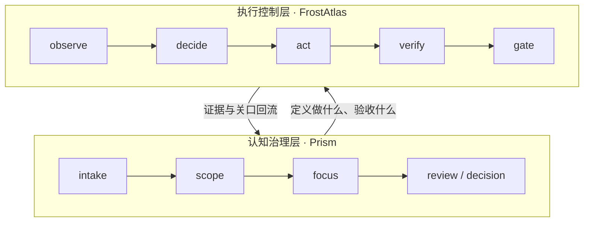

<div align="center">

# Prism

**轻量管理长期人机协作中的认知熵。**

[](LICENSE)
[](docs/prism-3.0.md)
[](pyproject.toml)

[快速开始](#快速开始) · [开源生态](#开源生态) · [读什么](#读什么) · [工具入口](#工具入口) · [Contributing](#contributing)

</div>

Prism 是一套**本地优先、无侵入**的轻量认知熵管理框架。它把共享规则、CLI、技能分发与项目状态容器组合成一个可长期运转的个人协作基座；通过软链接桥接将共享规则折射进本地工作区——不接管目录结构，不污染版本历史。

> 共享规则，本地状态，清晰边界。

**当前阶段**：`v3.0-canary`（dogfood 验证期）— `focus` 单入口、按需 `task` 递归分解、README grandfather 兼容；内置 **workflow** 是一套可选的认知熵治理工作流。  
**快速判断 Prism 是否成立** → [docs/prism-3.0.md](docs/prism-3.0.md) · **已有 workspace 接入** → [docs/workspace-v3-upgrade.md](docs/workspace-v3-upgrade.md) · **v2.0 历史** → [docs/prism-2.0.md](docs/prism-2.0.md)

---

## 开源生态

近期与 [FrostAtlas](https://github.com/ArnoFrost/FrostAtlas) 一并开源的两套工具，解决长程 AI 协作里不同层面的失控问题：

| | **Prism**（本仓库） | **[FrostAtlas](https://github.com/ArnoFrost/FrostAtlas)** |
|---|---|---|
| **一句话** | 轻量认知熵管理框架 | 治具优先的长程 Agent 控制面 |
| **管什么** | 边界、注意力、决策链、跨会话恢复 | 完成合同、证据验证、关口、执行审计 |
| **核心工件** | `scope` / `focus` / `decision` / `review` | `scope`（合同）/ `handover` / `evidence` / `gate` |
| **典型场景** | 专项推进、评审收敛、多人/多 Agent 协作状态 | 数十步工程任务、自动化迭代、断点恢复 |
| **立场** | 降低“忘了为什么、重复争论、读不懂下一步” | 降低“Agent 自称完成、无检查点漂移、状态只在上下文里” |



**怎么组合用**：在 Prism 里把目标、边界和决策链治理清楚；当任务需要 Agent 长程自动执行时，用 FrostAtlas 包裹执行循环，用合同 + 证据 + 关口约束“真的完成”。二者互补，不互相替代。

| 你想… | 优先看 |
|--------|--------|
| 治理 topic 状态、评审与决策 | 本仓库 + [skill-taxonomy](docs/skill-taxonomy.md) |
| 治理 Agent 多轮执行与完成判定 | [FrostAtlas README](https://github.com/ArnoFrost/FrostAtlas) |
| 从 v2 迁到 v3 focus 入口 | [workspace-v3-upgrade](docs/workspace-v3-upgrade.md) |

## 快速开始

### 仓库地址

GitHub 公开版从以下地址克隆：

```bash
git clone git@github.com:ArnoFrost/prism.git ~/prism
```

> **公开 / 内部分发治理**：`main` 分支只维护 GitHub 公开口径，不暴露内部仓库地址、内部 MR 流程或内部安装路径。司内分发说明保留在 `internal` 分支或内部安装文档中维护。

### Agent 引导（推荐）

把这句话发给你的 AI Agent（Cursor / Claude Code / CodeBuddy）：

> 帮我克隆 `git@github.com:ArnoFrost/prism.git` 到 `~/prism`，然后读取 `~/prism/SETUP.md` 并按里面的指引帮我完成初始化。

### 手动安装

```bash
# 1. Clone SDK（core contract）
git clone git@github.com:ArnoFrost/prism.git ~/prism
# 可选：外部 Skills 扩展
git clone git@github.com:ArnoFrost/prism-skills.git ~/prism-skills
```

### 首屏闭环

Prism 的核心使用路径只有四步：

```
配置 → 桥接 → 接入 → 聚焦/评审
```


| 步骤     | 命令 / 入口             | 做什么                          |
| ------ | ------------------- | ---------------------------- |
| **配置** | `bin/setenv --init` | 填写本地路径，生成 `prism.local.yaml` |
| **桥接** | `bin/relink`        | 刷新所有软链接（项目 + Skills → IDE）   |
| **接入** | `/workspace-init`   | 让已有项目接入 Prism 工作区            |
| **聚焦/评审** | `/workflow-scope` / `/workflow-review` | 从 scope 刷新 focus，必要时多角色评审 |


前两步是 SDK 工具，后两步是 AI Skill（通过 Agent 调用）。

### 交付口径

Prism 的交付术语分三层：

| 术语 | 含义 |
|------|------|
| **core contract** | 最小运行合同：SDK 内置 workflow/workspace + Vault Workspace + `uv`。它回答“Prism 最少依赖什么还能跑”。 |
| **mini profile / package** | 基于 core contract 的默认轻量交付形态。它回答“如何给别人一个开箱可用的精简版”。 |
| **full profile** | core contract + 外部 Skills / Env 等扩展能力。它回答“维护者或进阶用户如何组合完整能力”。 |

因此 `core` 不是一个单独分支或产品；`mini` 也不是长期并行分支。`mini` 是基于 core contract 的轻量 profile / package。

---

## 读什么

README 只负责入口导航。想深入某一层，请读对应文档：

| 你想了解 | 入口 |
|----------|------|
| Prism 3.0 为什么是轻量认知熵管理框架 | [docs/prism-3.0.md](docs/prism-3.0.md) |
| 已有 workspace 如何渐进接入 v3 | [docs/workspace-v3-upgrade.md](docs/workspace-v3-upgrade.md) |
| topic 从 intake 到 archive 怎么走 | [docs/topic-lifecycle.md](docs/topic-lifecycle.md) |
| 每个 workflow skill 治理什么熵 | [docs/skill-taxonomy.md](docs/skill-taxonomy.md) |
| 完整架构与部署视图 | [docs/architecture.md](docs/architecture.md) |
| 术语速查 | [docs/glossary.md](docs/glossary.md) |
| 历史迁移 | [docs/migration.md](docs/migration.md) |

Prism 当前以四个正交载体协同工作：SDK 承载协议/模板/CLI，Skills 承载可复用能力，Env 承载个人环境，Workspace 承载项目状态。其中 workflow skills 是内置的认知熵治理工作流，用来把混沌需求收敛成可恢复、可追踪、可协作的状态。详细分层见 [docs/architecture.md](docs/architecture.md)。

`bin/relink` 会将 SDK 内置 workflow skills 分发到 IDE 目录（Cursor · Claude Code · CodeBuddy · Codex），无需手动配置。

> **workflow / 痕迹义务家族都是可选项**
>
> Prism 的 core contract（最小运行合同）只要求 SDK + Vault Workspace + `uv`。**workflow 系列技能** 与配套的 **痕迹义务家族**（`task_probe` / `decision_artifact` / `intake_gate_out` / `merge_artifact`，自 v2.0 起永久封顶在 4 族）是认知熵治理工作流的可选增强：
>
> - **不用 workflow 技能**：项目状态可纯手写到 `workspace.{code}.local/` 下，Prism 不强制 review/decision/scope 三件套
> - **不用痕迹义务（默认行为）**：`prism finalize` Step 2.5 默认 lenient — 只 WARN 不 ERR，不阻塞 `success: true`；`bin/prism validate-trace --lenient` 同效
> - **完全跳过痕迹**：`finalize --no-trace-validate` 或 `PRISM_TRACE_VALIDATE=off`（CI 渐进接入用）
> - **strict 模式启用**：通过 frontmatter `trace_strict: true` / `PRISM_TRACE_VALIDATE=strict` / `--trace-strict` 升级为 strict（任一族 missing 即 ERR）。完整优先级：CLI flag > ENV > frontmatter > 配置前缀默认（`prism_cli._STRICT_DEFAULT_PREFIXES`，**默认空集** — strict 为显式 opt-in，不再硬编码任何 topic 编号）
>
> 仅当你需要"多角色独立评审 + 决策可审计 + 入料路由防膨胀"等结构化协作场景时，workflow + trace 才进入产品默认行为。心智门槛不要把它当作 Prism 的硬入口。

---

## 工具入口

Prism 的命令面分两层，职责正交——`bin/` 管仓库/环境级动作，`prism <verb>` 管 workspace/topic 级动作：

### `bin/` — 仓库级工具


| 命令                     | 职责                                                                               |
| ---------------------- | -------------------------------------------------------------------------------- |
| `bin/setup`            | 一键初始化 / 健康检查 / 重配置检测（仓库→配置→relink→IDE→报告，`--check` 仅检查，`--non-interactive` 脚本调用） |
| `bin/doctor`           | 统一体检入口（`--scope env/skill/sync/cli/config/release`，`--fix` 非破坏性自动修复）             |
| `bin/setenv`           | 管理 `prism.local.yaml` 配置                                                         |
| `bin/relink`           | 刷新所有软链接                                                                          |
| `bin/create-skill`     | 从模板创建新 skill 骨架（支持 `--layer sdk/skills/env`）                                     |
| `bin/validate-skills`  | 扫描全量 skill frontmatter 合规性                                                       |
| `bin/clean`            | 归档技能管理（`--add/--restore/--list`）                                                 |
| `bin/rename-artifacts` | 批量重命名产物                                                                          |


### `prism <verb>` — workflow 级 CLI


| 命令               | 职责                                                |
| ---------------- | ------------------------------------------------- |
| `prism sniff`    | 探测 topic_affinity / 下一轮编号（`--kind review\|intake`） |
| `prism validate` | 校验 topic 产物格式（frontmatter / 命名规范，`--fix` 自动修复） |
| `prism archive`  | 归档 topic 到 `archive/` |
| `prism migrate`  | 迁移历史 review 子目录格式 |
| `prism sync`     | 嗅探 SDK / Skills / Env 三仓 Git 状态 |
| `prism finalize` | Decision 后一键串联 tidy → validate → **validate-trace (Step 2.5)** → scope 提示 |
| `prism tidy`     | 工件机械对齐（focus 入口 / 索引 / frontmatter；README 仅存量兜底） |
| `prism status`   | Workspace 活跃 topic 健康度扫描 |
| `prism digest`   | Topic 工件采集，供摘要/汇报生成 |
| `prism validate-trace` | 扫描 topic 痕迹义务家族（task_probe / decision_artifact / intake_gate_out / merge_artifact），`--lenient` 旧产物迁移期使用 |
| `prism manifest` | 导出 verb registry 元数据 |


详见 [bin/README.md](bin/README.md)。

如需查看当前 CLI 能力面的机器可见真源，优先运行：

```bash
prism --json manifest
```

---

## CLI 稳定性承诺

`bin/` 与 `prism <verb>` 遵循稳定性承诺：

- **新增稳定**：新增命令 / 新增可选参数 / 新增 JSON 字段 可在任意 minor 版本落地，不视为破坏性变更
- **改名/删除走双 minor 保留**：破坏性变更在 N+1 引入新命令并对旧命令打 WARN，N+2 才移除
- **experimental 标记**：标注为 experimental 的 verb（当前：`prism migrate` / `prism finalize` / `prism tidy` / `prism status` / `prism digest` / `prism validate-trace` / `prism manifest`）可能在下一个 minor 改名或改参数
- **历史 breaking change**：`prism pipeline` 已物理移除；旧调用方请改用 `prism finalize`
- **historic exemption**：`prism sync` 是唯一历史豁免（实际偏 `bin/` 语义），**不可援引为新豁免的先例**

> 完整命令面契约、分层判断树、稳定性分级与破坏性变更策略见 [docs/cli-contract.md](docs/cli-contract.md)。

---

## 为什么叫 Prism

棱镜本身不发光，它只负责折射光线。

Prism 在 AI 协作里的角色也是如此——共享规则保留在上游，本地上下文保留在个人工作区，两者通过轻量协议与软链接完成折射融合。

---

## Contributing

欢迎提交 Issue 和 Pull Request。

- Skills 贡献请提交到 [prism-skills](https://github.com/ArnoFrost/prism-skills)
- SDK 层变更请遵循 [AGENTS.md](AGENTS.md) 中定义的协作契约
- Commit 信息使用 [Conventional Commits](https://www.conventionalcommits.org/) 规范

**注意**: 

- GitHub 用户请提交 PR 到 [github.com/ArnoFrost/prism](https://github.com/ArnoFrost/prism)
- 内部分支与司内 MR 流程不在 `main` 公开 README 中维护；请以内部安装文档为准。

## License

[MIT](LICENSE)

---

*折射协议，保留本地。*
