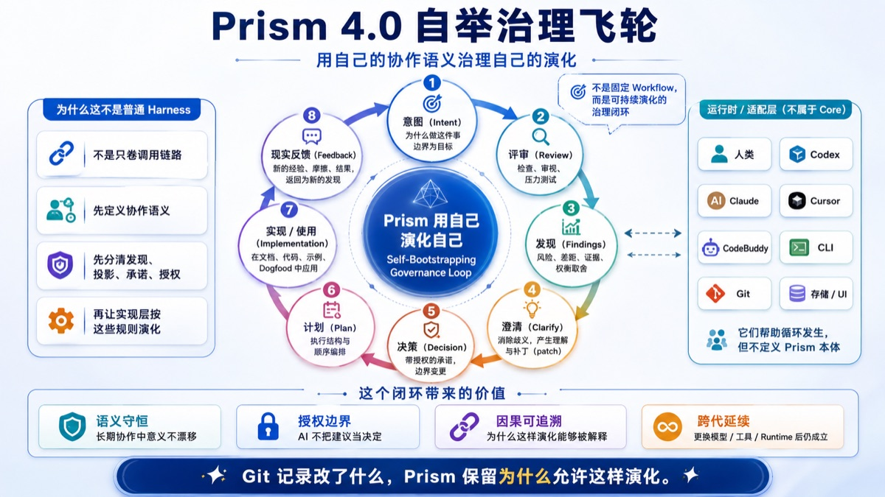

<div align="center">


# Prism

**人与 AI 共同维护清晰的协作状态。**

[](LICENSE)
[](CHANGELOG.md)
[](pyproject.toml)

[快速开始](#快速开始) · [4.0 Skills](#prism-40-skills) · [生命周期](#生命周期总览) · [读什么](#读什么) · [工具入口](#工具入口) · [Contributing](#contributing)

</div>

Prism 4.0 是一层轻量协作协议。**Protocol Core** 只有 Topic / Artifact / Capability / Invocation / Decision Semantics。它本地优先、无侵入：共享规则通过软链接折射进工作区，不接管目录，不污染版本历史。

> 共享规则，本地状态，清晰边界。

| 你要… | 看 |
|--------|----|
| 愿景与协作契约 | [AGENTS.md](AGENTS.md) |
| 语义边界（什么算 Core） | [docs/prism-4-refoundation-alignment.md](docs/prism-4-refoundation-alignment.md) |
| 安装并跑起来 | 下文 [快速开始](#快速开始) · SDK + `uv` |

**当前发行**：4.0-canary。默认技能面是 `/prism-topic` · `/prism-brief` · `/prism-review` · `/prism-clarify` · `/prism-compress`。`prism` 进入 4.0 reference adapter。3.x 实现已从本分支剔除（终态见 git tag `legacy-3x-final`；旧 topic 只读）。

**发行**：`prism --version`（同源 [`VERSION`](VERSION) · [CHANGELOG](CHANGELOG.md)）

---

## 快速上手

**30 秒跑通第一环**：

```bash
# 1. 安装（clone + 一键 init）
git clone https://github.com/ArnoFrost/prism.git ~/prism
cd ~/prism && ./setup.sh init
prism --version

# 2. 进入你的项目，桥接 Workspace
cd ~/your-project
prism host attach --code MYPROJ

# 3. 创建第一个 Topic，开始协作
prism topic new topic:my-first --title "我的第一个专项" --intent "要解决的问题"
```

之后：Agent 里 `/prism-topic` 起新边界，`/prism-brief` 恢复上下文，`/prism-review` 留 Findings，`/prism-clarify` 解阻塞。完整阶段表见 **[生命周期总览](#生命周期总览)**。

| 入口 | 读者 |
|------|------|
| [SETUP_GITHUB.md](SETUP_GITHUB.md) | 人类分步说明 |
| [SETUP_AGENT.md](SETUP_AGENT.md) | Agent 协议 |
| [docs/onboarding.md](docs/onboarding.md) | init **之后**日常 / update / doctor |

### Agent 引导

> 帮我 clone `https://github.com/ArnoFrost/prism.git` 到 `~/prism`，执行 `./setup.sh init` 使用默认本地 Workspace backend，并读 `SETUP_AGENT.md` 完成验收。

---

## 生命周期总览

从 clone 到长期维护：

```text
./setup.sh init → prism --version 验收 → relink / 桥接
              → /prism-topic（先 probe）→ update / doctor / relink 维护
```

| 阶段 | 命令 | 做什么 |
|------|------|--------|
| **init** | `./setup.sh init` | 配置 + relink + CLI + uv |
| **验收** | `prism --version` · `./setup.sh check` | init 闭环 |
| **桥接** | `prism relink` · `./setup.sh relink` | 本地 Workspace backend + 可选 IDE 软链 |
| **接入** | `prism relink` · `/prism-topic` | 已有仓库挂 workspace，或创建 4.0 Topic |
| **topic** | `prism topic list` · `/prism-topic` | 4.0 协作边界（见下节） |
| **升级** | `prism update` · `./setup.sh update` | pull → doctor ci → relink --no-workspace |
| **诊断** | `prism doctor --scope config\|release\|ci` | 分 scope 体检 |

---

## Prism 4.0 Skills

默认技能围绕协议原语，按需组合，没有固定管线。Findings 不授权；Clarify payload 只是候选；Decision 才固化承诺。Brief 可再生成，不是事实源。

| 你想… | 入口 |
|--------|------|
| 创建或定位协作边界 | `/prism-topic` · `prism topic ...` |
| 恢复当前上下文切片 | `/prism-brief` · `prism brief project ...` |
| 审视现状并留下 Findings | `/prism-review` · `prism review record ...` |
| 澄清一个阻塞取舍 | `/prism-clarify` · `prism clarify record ...` |
| 对齐阅读面并同步进度 | `/prism-compress`（低频；先 preview） |

`bin/relink` 分发 `skills/prism4/*`（唯一技能面）。

最小能跑 = SDK + `uv`（Minimal Reference Installation）。Skills、Env、Vault 都是可选部署。

---

## 读什么

先读两份主线，再按需下钻。完整分类见 **[docs/README.md](docs/README.md)**。

| 你想了解 | 入口 |
|----------|------|
| **4.0 愿景与协作契约** | [AGENTS.md](AGENTS.md) |
| **安装（人类 / Agent）** | [SETUP_GITHUB.md](SETUP_GITHUB.md) · [SETUP_AGENT.md](SETUP_AGENT.md) |
| **语义边界与术语** | [docs/prism-4-refoundation-alignment.md](docs/prism-4-refoundation-alignment.md) |
| **init 后日常** | [docs/onboarding.md](docs/onboarding.md) · 上文 [生命周期总览](#生命周期总览) |
| **分发与参考实现怎么放** | [docs/architecture.md](docs/architecture.md) |

旧 3.x 文档、施工笔记和 zip 包不定义 4.0，见 [docs/README.md](docs/README.md) 的 C/D 区与 `prism dist`（maintenance-only）。

`bin/relink` 把当前 skill profile 分发到 IDE（Cursor · Claude Code · CodeBuddy · Codex）。

---

## 工具入口

Prism 对外以 `prism` CLI 为统一日常入口；`./setup.sh init` 保留为首次 bootstrap。`bin/` 是 CLI 内部适配与维护者调试面，不作为新增用户能力的首选入口。

### `bin/` — 内部适配 / 维护者工具


| 命令                     | 职责                                                                               |
| ---------------------- | -------------------------------------------------------------------------------- |
| `bin/setup`            | 一键初始化 / 健康检查 / 重配置检测（仓库→配置→relink→IDE→报告，`--check` 仅检查，`--non-interactive` 脚本调用） |
| `bin/doctor`           | 统一体检入口（`--scope env/skill/cli/config/release`，`--fix` 非破坏性自动修复）             |
| `bin/setenv`           | 管理 `prism.local.yaml` 配置                                                         |
| `bin/relink`           | 刷新项目/Skills IDE 软链接；默认分发 4.0 semantic skills                                          |
| `bin/create-skill`     | 从模板创建新 skill 骨架（支持 `--layer sdk/skills/env`）                                     |
| `bin/validate-skills`  | 扫描全量 skill frontmatter 合规性                                                       |
| `bin/clean`            | relink 逆操作（清理软链）+ 归档技能管理（`--add/--restore/--list`）                                                 |


### `prism <verb>` — 4.0 reference CLI


| 命令               | 职责                                                |
| ---------------- | ------------------------------------------------- |
| `prism topic probe` | 机械探测当前目录是否已桥接 Workspace |
| `prism topic new` | 创建 4.0 Topic 边界 |
| `prism topic list` | 列出 4.0 Topic |
| `prism host attach` | 登记项目并桥接 `workspace.{code}.local`（不调用 3.x init） |
| `prism artifact show` | 查看 4.0 Artifact / Payload 正文 |
| `prism brief project` | 从当前状态投影 Brief，用于 context recovery |
| `prism review record` | 持久化 Review 结果为 Findings（advisory；不等于授权） |
| `prism clarify record` | 持久化 Clarify payload（候选，不是 Decision） |
| `prism plan record` | 持久化 Plan |
| `prism decision record` | 记录被授权的 Decision |
| `prism relink`   | 刷新项目/Skills IDE 软链接（委托 `bin/relink`） |
| `prism doctor`   | 仓库/环境体检（委托 `bin/doctor`） |
| `prism update`   | 拉取 SDK 并执行核心 doctor + 代码层 relink（experimental；Vault/Workspace 可选） |
| `prism dist`     | 分发统一 facade（experimental）；mini/full 仅 legacy maintenance-only |

旧 3.x verb（`sniff / validate / finalize / status / digest` 等）已随分支剔除；旧 topic 只读，要操作请切 3.x 分支或 `legacy-3x-final` tag。

详见 [bin/README.md](bin/README.md)。长文本用 `--body -`（stdin）或 `--body @path`；4.0 record 的 `--json` 只输出 `{ok, ids}`，不是 3.x outer schema。

Relation 写入保持在现有 record surfaces 上，不新增 lifecycle DSL：

```bash
prism review record ... --supersedes finding:f01
prism plan record ... --supersedes plan:p01
prism decision record ... --authorizes plan:p02
prism decision record ... --supersedes decision:d01
```

`supersedes` 只表达被后续工件取代；`authorizes` 只表达 Decision 对某个 Artifact 的授权关系。Reference creates provenance；acceptance creates authority。

如需查看当前 4.0 CLI 能力面，优先运行：

```bash
prism --help
```

---

## CLI 稳定性承诺

`bin/` 与 `prism <verb>` 遵循稳定性承诺：

- **新增稳定**：新增命令 / 新增可选参数 / 新增 JSON 字段 可在任意 minor 版本落地，不视为破坏性变更
- **改名/删除走双 minor 保留**：破坏性变更在 N+1 引入新命令并对旧命令打 WARN，N+2 才移除
- **experimental 标记**：标注为 experimental 的 verb（当前含 4.0 `topic / artifact / brief / review / clarify / plan / decision` 与部分 facade）可能在下一个 minor 改名或改参数
- **历史 breaking change**：`prism pipeline` 已物理移除；3.x 实现整体剔除见 [docs/migration.md](docs/migration.md)

> 3.x 时代的完整命令面契约已归档：[docs/historical/cli-contract.md](docs/historical/cli-contract.md)。4.0 当前命令面以 `prism --help` 为准。

---

## 为什么叫 Prism

棱镜本身不发光，它只负责折射光线。

Prism 在 AI 协作里的角色也是如此——共享规则保留在上游，本地上下文保留在个人工作区，两者通过轻量协议与软链接完成折射融合。



两条演进原则：

- **去伪存真**：叙事历史（文档、CHANGELOG）保留；可执行历史（旧实现、shim、fallback）剔除。
- **分支即兼容边界**：旧版本由 git 分支 / tag 承接（3.x 终态见 `legacy-3x-final`），当前分支只承载当前版本。

---

## Contributing

欢迎提交 Issue 和 Pull Request。

- Skills 贡献请提交到 [prism-skills](https://github.com/ArnoFrost/prism-skills)
- SDK 层变更请遵循 [AGENTS.md](AGENTS.md) 中定义的协作契约
- Commit 信息使用 [Conventional Commits](https://www.conventionalcommits.org/) 规范

**注意**: 

- GitHub 用户请提交 PR 到 [github.com/ArnoFrost/prism](https://github.com/ArnoFrost/prism)
- 内部分支与司内 MR 流程不在 `main` 公开 README 中维护；请以内部安装文档为准。

## License

[MIT](LICENSE)

---

*折射协议，保留本地。*
