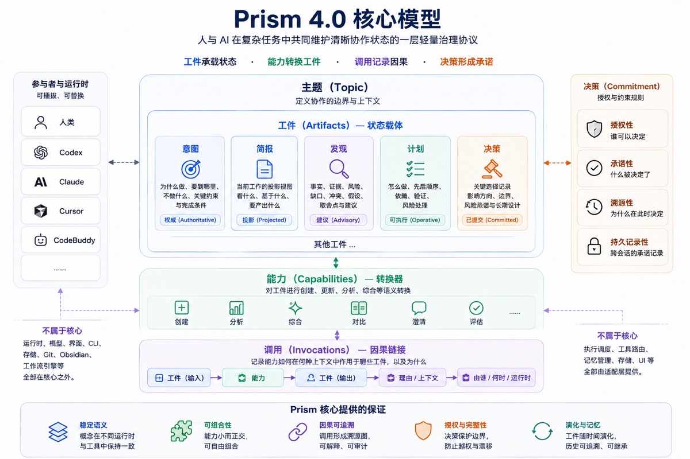
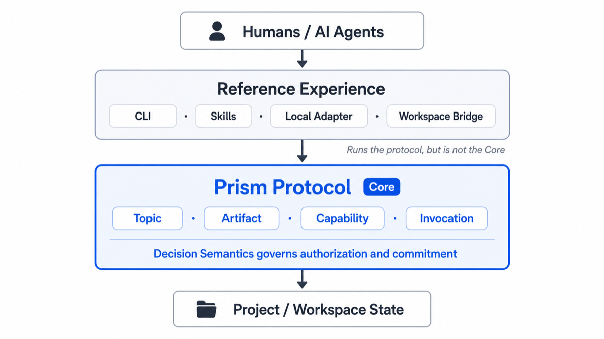
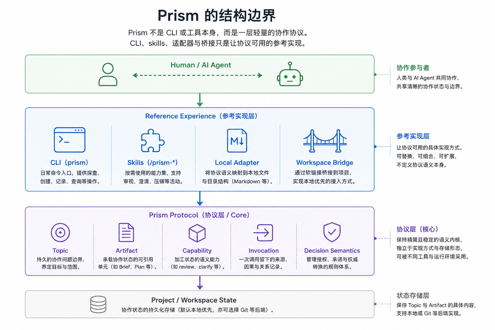

<div align="center">



# Prism

**人与 AI 共同维护清晰的协作状态。**

[](LICENSE)
[](CHANGELOG.md)
[](pyproject.toml)

[快速开始](#快速开始) · [为什么选择 Prism](#为什么选择-prism) · [核心概念](#核心概念) · [日常使用](#日常使用) · [项目状态](#项目状态与稳定性) · [贡献](#contributing--support)

</div>

Prism 4.0 is a local-first collaboration protocol for humans and AI agents.

它解决的问题很具体：在多轮 AI 协作里，目标、上下文、判断、计划和授权很容易散落在聊天记录、临时 Markdown、Issue、代码注释和个人记忆里。Prism 用一层轻量协议保存共享协作状态，让人和 Agent 都能知道当前问题边界、已有发现、哪些只是建议、哪些已经成为承诺。

Prism Protocol revolves around **Topic / Artifact / Capability / Invocation**, with **Decision Semantics** governing authorization and commitment. Reference Experience 提供 CLI、Markdown/local adapter、`prism-*` skills 和 Workspace bridge；它们让协议跑起来，但不把实现细节提升为 Core。

适合：

- 长期和 AI 一起推进代码、文档、工具或架构治理的人。
- 想把“AI 建议”和“人类授权”分清楚的维护者。
- 希望本地状态可追踪，但不想让项目仓库被协作痕迹接管的使用者。

不是什么：

- 不是任务调度器。
- 不是 Agent 编排平台。
- 不是知识库替代品。
- 不是重型运行时。

**当前发行**：4.0-canary。当前处于 **P5 optimistic dogfood**：默认 Distribution Profile 只分发 `/prism`、`/prism-review`、`/prism-plan` 三个入口，仍属 experimental，不代表 P6 稳定切换。旧 wrappers `prism-topic / prism-brief / prism-clarify / prism-compress` 保留在 SDK 中作为 control / compatibility / rollback source，**不属于当前默认分发面**。3.x 实现已从本分支剔除，终态见 git tag `legacy-3x-final`；旧 topic 在本分支只读。

---

## 快速开始

Reference implementation 需要 Python 3.11+ 和 `uv`。

```bash
# 1. 获取 Prism repository
git clone https://github.com/ArnoFrost/prism.git ~/prism
cd ~/prism
./setup.sh init

# 2. 验收当前安装
prism --version
./setup.sh check

# 3. 进入你的项目并桥接 Workspace
cd ~/your-project
prism host attach --code MYPROJ
prism topic probe

# 4. 创建第一个协作边界
prism topic new topic:my-first --title "My first Prism topic" --intent "What we are trying to resolve"
```

成功信号：

- `prism --version` 输出当前 [`VERSION`](VERSION)。
- `./setup.sh check` 完成本机安装检查。
- `prism topic probe` 显示 `bridged: yes`。
- `prism topic list` 能看到你创建的 4.0 Topic。

到这里，Prism 已经挂到你的项目上，并创建了一个可在后续 Agent 会话中复用的协作问题边界。

失败后先看 [docs/onboarding.md](docs/onboarding.md)，或运行：

```bash
prism doctor --scope config --quick
```

Agent 引导可直接使用：

> 帮我 clone `https://github.com/ArnoFrost/prism.git` 到 `~/prism`，执行 `./setup.sh init` 使用默认本地 Workspace backend，并用 `prism --version` 与 `./setup.sh check` 完成验收。

---

## 会创建什么

Prism 的默认接入方式是本地优先、软链接桥接，不要求改造你的项目结构。

| 位置 | 会发生什么 | 是否应提交到业务项目仓库 |
|------|------------|----------------------|
| `~/prism` | Prism repository：协议文档、参考 CLI、默认 4.0 skills | 否；它是独立仓库 |
| `prism.local.yaml` | 本机路径配置，由 `bin/setenv` / `setup.sh` 管理 | 否 |
| 默认 Workspace backend | 存放项目级协作状态；默认本地目录 | 否，除非你显式选择 Git backend |
| `workspace.{code}.local` | 业务项目里的 Workspace 软链接 | 否 |
| `AGENTS.local.md` | 可选用户级上下文 | 否 |

`.local` 后缀表示本地个人状态。Prism 建议用全局 gitignore 覆盖 `workspace.*.local`、`AGENTS.local.md`、`prism.local.yaml`，避免把协作状态误提交到业务仓库。

外部 Skills、Env、Vault/Git backend 都是可选部署；缺失不阻断最小参考体验。

---

## 为什么选择 Prism

| 优势 | 机制 | 收益 | 验证入口 |
|------|------|------|----------|
| 本地优先 | 默认 local backend + `workspace.{code}.local` bridge | 协作状态留在用户控制范围内 | [快速开始](#快速开始) |
| 无侵入接入 | 软链接 + `.local` 约定 + 全局 gitignore | 不接管业务仓库目录结构 | [会创建什么](#会创建什么) |
| Small protocol surface | Topic / Artifact / Capability / Invocation + Decision Semantics | 不绑定某个 Agent harness 或文件格式 | [核心概念](#核心概念) |
| 能力可组合 | `/prism` 状态操作 + `/prism-review`、`/prism-plan` 认知入口 | 不预设固定治理管线 | [日常使用](#日常使用) |
| 授权边界清楚 | Findings / Plan 是 advisory；Decision records authorized commitment | AI 建议不等于已批准变更 | [核心概念](#核心概念) |
| Brief 可再生成 | Brief 是 context recovery projection | 跨会话恢复更轻，不把切片当事实源 | [docs/prism-4-refoundation-alignment.md](docs/prism-4-refoundation-alignment.md) |
| 部署可选 | Skills、Env、Vault/Git backend 都在 Core 外 | Prism repository + `uv` 即可跑通 | [docs/architecture.md](docs/architecture.md) |
| 发布可验收 | pytest + release gate + docs guard | 版本提升时能检查叙事和元数据漂移 | [docs/testing-contract.md](docs/testing-contract.md) |

Prism 当前不宣称自动闭环、成熟稳定的生产承诺、Agent 编排、任务调度、知识库替代或企业级安全合规。

---

## 核心概念

Protocol Core 保持很小：

| 概念 | 一句话 |
|------|--------|
| Topic | 持久的协作问题边界 |
| Artifact | 承载不可安全遗忘协作状态的可引用单元 |
| Capability | 加工状态的语义能力 |
| Invocation | 一次调用留下的来源、因果和关系记录 |
| Decision Semantics | 管理 authority、commitment、supersession 和 affected artifacts 的规则 |

常见 Artifact roles：

| Role | 作用 | Authority |
|------|------|-----------|
| Intent | 当前目标、边界和完成条件 | authoritative until superseded |
| Brief | 当前上下文恢复切片 | projection，可再生成 |
| Findings | 仍无法吸收的重要悬置判断与关键证据 | advisory |
| Plan | 当前可审查、可执行、可验证的实施方案 | advisory until accepted; not a projection |
| Decision | 效力超出单一 Plan 生命周期的重要承诺 | authoritative / committed |

`supersedes` 表示一个 Artifact 被后续 Artifact 取代；`authorizes` 表示 Decision 可对某个 Artifact 形成授权关系。它们是关系，不是新的 lifecycle DSL。

更多语义边界见 [docs/prism-4-refoundation-alignment.md](docs/prism-4-refoundation-alignment.md)。

---

## 日常使用

日常优先使用 `prism <verb>`。`./setup.sh` 保留为首次 bootstrap 和本机维护入口；`bin/` 是内部适配与维护者调试面。

| 你想做什么 | 入口 |
|------------|------|
| 查看当前项目是否已桥接 | `/prism`（Topic）· `prism topic probe` |
| 创建或列出 Topic | `/prism`（Topic）· `prism topic new` · `prism topic list` |
| 查看 Artifact 正文 | `prism artifact show` |
| 生成上下文恢复切片 | `/prism`（Recover）· `prism brief project` |
| 留下审视结果 | `prism review record` · `/prism-review` |
| 澄清一个阻塞歧义 | `/prism`（Clarify）· `prism clarify record` |
| 主动设计行动结构 | `/prism-plan`（默认局部规划） |
| 吸收已获授权的结果 | `/prism`（Absorb） |
| 低频校准阅读面 | `/prism`（Maintain，先 preview） |
| 持久化行动结构快照 | advanced `prism plan record`（默认替代当前 active Plan） |
| 记录已授权 Decision | `prism decision record` |
| 刷新软链接或检查环境 | `prism relink` · `prism doctor` |

Use what the situation needs:

| Skill | 用途 |
|-------|------|
| `/prism` | Topic / Recover / Clarify / Absorb / Maintain 状态操作门面 |
| `/prism-review` | 审视现状并输出 Findings |
| `/prism-plan` | 主动设计 advisory 行动结构 |

这是当前 P5 optimistic dogfood 的三入口表面，不是顺序管线，也不代表 P6。旧 wrappers 仍可在 SDK 源码中用于对照、兼容和回滚，但不属于当前默认 Distribution Profile。Review 不自动进入 Clarify，Plan 不自动获得授权，Decision 才记录承诺。
Plan 只回答当前怎么做：行动结构、执行顺序和验证策略。它不是旧 Scope，也不是 Brief/Roadmap 一类投影；边界看 Intent，授权看 Decision 或当前明确的人类指令。

完整 CLI 面看：

```bash
prism --help
```

维护者命令详见 [bin/README.md](bin/README.md)。

---

## 架构速览

Prism 不是 CLI 本身。CLI、skills、Markdown/local adapter 和 Workspace bridge 是让协议可用的 reference experience。



这张图只表达一个边界：Reference Experience 让协议可用，但不定义协议本身。Decision Semantics 也不是另一个 runtime object；它治理授权与承诺规则。

```text
Human / Agent
      |
Reference Experience
CLI · Skills · Local Adapter · Workspace Bridge
      |
-----------------------------------------------
Prism Protocol
Topic · Artifact · Capability · Invocation
Decision Semantics governs authorization
```

边界规则：

- Protocol Core 回答“哪些协作语义稳定”。
- Reference Experience 回答“这些语义如何在本机跑起来”。
- Workspace state 是项目级协作状态，不回写 Prism repository。
- Skills、Env、Vault/Git backend 都是可选扩展。

更完整的结构边界图：



深入说明见 [docs/architecture.md](docs/architecture.md)。

---

## 项目状态与稳定性

| 项 | 当前口径 |
|----|----------|
| Release | [`4.0-canary`](VERSION) |
| Package version | `4.0.0.dev0`（PEP 440） |
| Python | 3.11+ |
| License | [MIT](LICENSE) |
| 当前命令面 | `prism --help` |
| 3.x 终态 | git tag `legacy-3x-final`；本分支只读 |

CLI 稳定性摘要：

- 新增命令、可选参数和 JSON 字段可在 minor 版本落地。
- 破坏性改名/删除遵循双 minor 保留窗口，除非已经处于 experimental 或历史迁移边界。
- 4.0 的 `topic / artifact / brief / review / clarify / plan / decision` 等 reference verbs 仍处于 experimental。

发行与版本同步规则见 [docs/release-process.md](docs/release-process.md)；历史变化见 [CHANGELOG.md](CHANGELOG.md)。

---

## 质量与发布

常用本地门禁：

```bash
uv run python bin/release_gate.py --json
uv run pytest
./setup.sh check
```

相关入口：

| 你要确认 | 入口 |
|----------|------|
| 测试分层与新增测试原则 | [docs/testing-contract.md](docs/testing-contract.md) |
| 版本提升 checklist | [docs/release-process.md](docs/release-process.md) |
| CI 实际执行内容 | [.github/workflows/ci.yml](.github/workflows/ci.yml) |
| init 后日常与 E2E 验收 | [docs/onboarding.md](docs/onboarding.md) |

---

## 文档导航

先读两份主线，再按需下钻。完整分类见 [docs/README.md](docs/README.md)。

| 你想了解 | 入口 |
|----------|------|
| 协作契约与项目边界 | [AGENTS.md](AGENTS.md) |
| init 后日常 | [docs/onboarding.md](docs/onboarding.md) |
| 4.0 语义地基 | [docs/prism-4-refoundation-alignment.md](docs/prism-4-refoundation-alignment.md) |
| 分发与参考实现 | [docs/architecture.md](docs/architecture.md) |
| 3.x 迁移与历史 | [docs/migration.md](docs/migration.md) · [docs/historical/](docs/historical/) |

---

## Contributing & Support

欢迎提交 Issue 和 Pull Request：

- GitHub Issues：[github.com/ArnoFrost/prism/issues](https://github.com/ArnoFrost/prism/issues)
- Prism repository 贡献请读 [docs/contributing.md](docs/contributing.md)
- Skills 贡献请提交到 [prism-skills](https://github.com/ArnoFrost/prism-skills)
- Commit 信息使用 [Conventional Commits](https://www.conventionalcommits.org/) 规范

## License

[MIT](LICENSE)

---

*折射协议，保留本地。*
