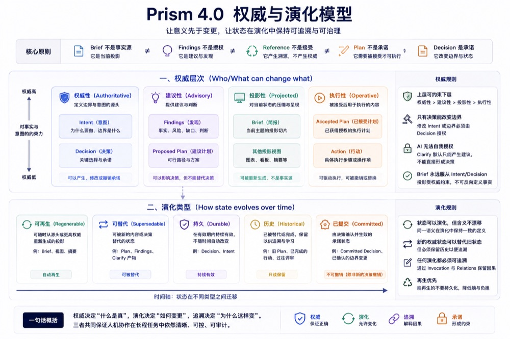
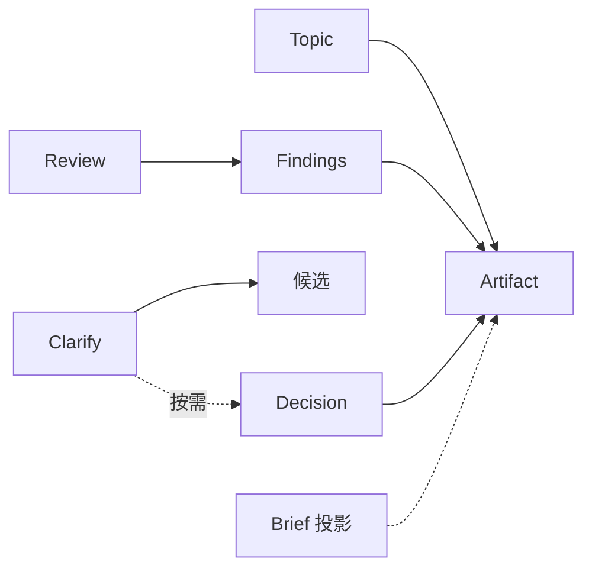
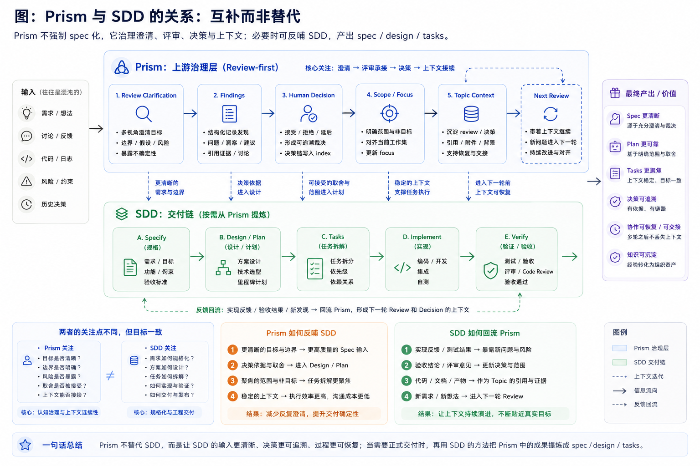

# Prism — 架构详解

> 公开叙事是三段式，不是新的 primitive。SDK / Skills / Workspace / Env 只解释「放哪」。文档分类见 [docs/README.md](./README.md)。首次使用请先读 [README](../README.md)；当前 4.0 语义见 [prism-4-refoundation-alignment.md](./prism-4-refoundation-alignment.md)；3.x 历史见 C 区。

---

## 公开叙事

| 层 | 回答什么 | 不是什么 |
|----|----------|----------|
| **Protocol Core** | Topic / Artifact / Capability / Invocation / Decision Semantics | 不是 SDK 仓库，也不是 `AGENTS.md` 这一份文件 |
| **Reference Experience** | 参考实现怎么好用：CLI、Markdown 适配器、`prism-*` skills、Workspace 桥接、Brief 投影 | 不是第二套 Core |

历史不是一层叙事，只是归档：3.x 叙事在 [`historical/`](./historical/)，可执行终态由 git tag `legacy-3x-final` 保管。**分支即兼容边界**——兼容由 Git 历史承载，不在工作树里供一份活源码。

禁止再画一张把 Core、Skill、Profile、Workspace、Adapter 并列的总表当「Prism 是什么」。

### 演进原则

064–070 系列实际确立、现行有效的两条：

- **奥卡姆 / 去伪存真**：叙事历史（文档、CHANGELOG）保留；可执行历史（旧实现、shim、fallback）剔除。能由 Git 保管的，不留在工作树。
- **分支即兼容边界**：旧版本能力用分支/tag 承接，当前分支只承载当前版本。旧 topic 只读，不就地维护双栈。

---

## 分发与所有权

旧称「四层模型」。它只解释东西放在哪，嵌套在 Reference Experience 下，**不是** Protocol Core。



| 载体 | 职责 | 必需 | 典型落点 |
|------|------|:----:|----------|
| **SDK** | 协议文本、schema、模板、参考 CLI | 安装时是 | `~/prism` |
| **Skills** | 可复用的自然语言能力 | 可选 | SDK `skills/prism4/`（默认）+ 外部 `~/prism-skills` |
| **Workspace** | 项目级协作状态实例 | 逻辑上要有地方放 | 默认本地 backend，Vault/Git 可选 |
| **Env** | 运行环境与终端基座 | 可选 | 外部 DotFiles |

Skills 和 Env 不是硬依赖。分发面只有 `skills/prism4/`；3.x 实现已随 prism-4 分支剔除。

---

## 最小参考安装

新表面称 **Minimal Reference Installation** = SDK + `uv`。历史文档和 `bin/setup` / doctor 仍可能写 **core contract**，含义相同，本轮不改脚本字符串。

| 术语 | 定义 | 维护方式 |
|------|------|----------|
| **Minimal Reference Installation** | 最小能跑：SDK + `uv`；Workspace 实例默认可落本地 backend | 发行合同，不进 Protocol Core |
| **optional deployment** | 外部 Skills、Env、Vault/Git backend 按需组合 | 缺失不阻断 SDK/CLI |
| **legacy mini/full** | 历史 zip profile，仅保留安全修复、迁移兼容与弃用窗口 | maintenance-only |

可选部署回答「状态和扩展落在哪里」。mini/full 不再是主交付面，统一外部入口是 `prism` CLI。

> 兼容窗口：旧 `/prism-dist` Skill 仅作为可选兼容壳；新文档与自动化一律调用 `prism dist`。

---

## 部署视图

分发视图对应三个物理位置。SDK 是参考分发容器，不是 Protocol Core。

| 位置 | 含义 | 必需 | 放什么 |
|------|------|:----:|--------|
| **SDK 仓库** | 协议文本 + schema + 4.0 semantic skills + legacy 源码 + bin | 是 | 参考实现与默认技能面 |
| **外部技能仓库** | 个人工具、git 同步 | **可选** | Skills 扩展 |
| **Workspace backend**（默认本地，可选 Vault/Git） | 项目状态 | 是（逻辑实例） | Workspace 实例 |

外部技能仓库、Env 和 Vault backend 均按需配置；缺失时不阻断最小参考安装。

---

## 桥接模式

Prism 通过 `.local` 后缀软链接将 backend 中的 Workspace 挂载到工作仓库：

```
工作仓库/
├── workspace.{code}.local     → Workspace backend/{CODE}/
├── AGENTS.local.md            → 用户级协作上下文（可选）
└── AGENTS.personal.local.md   → 个人偏好（可选）
```

`.local` 后缀 = 本地个人文件，不提交到版本控制。推荐将 Prism 的 `.local` 模式配置在全局 gitignore 中，接入项目无需修改自身 `.gitignore`——真正的零侵入。详见 [AGENTS.md](../AGENTS.md)「无侵入原则」。

<details>
<summary>兼容模式（迁移期）</summary>

```
工作仓库/
└── ai-task.local              → AI-TASK vault projects/{CODE}/
```

两种模式可共存，`workspace.{code}.local` 优先。

</details>

---

## 4.0 Semantic Skills

Prism 4.0 的默认分发面不是固定 workflow，而是围绕协议原语组织的可组合能力：

| Skill | 触发 | 职责 |
|-------|------|------|
| `prism-topic` | `/prism-topic` | 管理 Topic 边界；child Topic 表达耐久子问题 |
| `prism-brief` | `/prism-brief` | 生成 Brief projection，用于 context recovery |
| `prism-review` | `/prism-review` | 运行 Review 能力，输出 Findings |
| `prism-clarify` | `/prism-clarify` | 单问澄清，输出候选 payload |
| `prism-compress` | `/prism-compress` | 低频对齐压缩阅读面，再生成 Brief |

`bin/relink` 的分发面只有 `prism4`；`--skill-profile legacy/all` 会诚实报错并指向 git tag。

能力按需组合，不预设固定顺序。Review 产出 Findings 后弱衔接（告知洞察与是否要 Clarify），不自动调用其他能力。



## Legacy Compatibility

本节不是 4.0 默认入口。3.x 实现已随 prism-4 分支剔除；本节保留为历史叙事，旧 topic 在本分支只读。

### 3.x 叙事锚点：轻量认知熵管理

v3.0 把上层目标写成**长期人机协作中的轻量认知熵管理**。认知熵不是 Protocol Core 术语；下表的机制列仍是 3.x 的 `intake` / `scope` / `focus` / `task`。

| 熵源 | 典型表现 | 3.x 机制 |
|------|----------|----------|
| 输入熵 | 原始想法混沌、边界不清 | `intake` / `scope` |
| 歧义熵 | 当前对话被一个人类取舍阻塞 | `clarify` 单问 micro-loop |
| 分析熵 | 判断隐性化、发现不可追溯 | `review` / findings |
| 决策熵 | 重复争论、结论漂移 | Decision Record / `decision.index` |
| 注意力熵 | 什么都重要、当前工作集膨胀 | `focus` |
| 结构熵 | 长期问题切片失控、目录变杂物间 | `task` / `structures` |
| 方向熵 | 不知道下一步该做什么 | `status` + `next_actions[]`（handoff-only） |
| 注意力熵 | 已结束 topic 仍占活跃注意力 | `archive` / `reactivate`（3.x，已剔除） |
| 上下文熵 | 跨会话、跨设备恢复成本高 | digest / compact preview→apply（按需） |

OpenSpec 更像 planning layer；3.x Prism workflow 更像 cognitive governance layer。二者可以串联。4.0 默认面用 Topic / Artifact / Capability / Decision，不再用这张熵源表定义「Prism 是什么」。

### Legacy Workflow 深潜（已剔除）

3.x 的 workflow 能力面（intake / scope / focus / task / wave、reviews/rXX、决策双门、痕迹义务抽检等）及其 `prism legacy` CLI 已随 prism-4 分支物理剔除。本分支不再保留其实现细节文档；叙事与契约归档在 [historical/](./historical/)（`prism-3.2.md`、`topic-lifecycle.md`、`skill-taxonomy.md`、`cli-contract.md`），可执行终态见 git tag `legacy-3x-final`。

### 痕迹义务家族封顶政策（v2.0 起永久生效）

3.x 时代 `validate-trace` 扫描的痕迹义务家族（trace obligation families）自 v2.0 起**永久封顶为 4 族**（本政策随 3.x 一并归档，4.0 无此概念）：

| 族 | 落点 | 用途 |
|---|---|---|
| `task_probe` | `reviews/rXX_*.md`（mode=full） | Task 工具并行调用探针 — 真并行 vs fallback 可观察痕迹 |
| `merge_artifact` | `reviews/rXX_*.md`（mode=full） | Merge Step 4 痕迹 — raw 文件落盘可审计 |
| `decision_artifact` | `decisions/dXX_*.md` | Gate 4 决策痕迹 — accept/reject/defer/other + 落盘状态可审计 |
| `intake_gate_out` | `intake.md` | Intake Gate Out 痕迹 — 防止 intake.md 膨胀 + 骨架文件缺失 |

**封顶约束（硬性，受守门测试保护）**：

- 不再新增第 5 族（`len(TRACE_FAMILIES) == 4` 由 `tests/test_trace_families_capped.py` 锚定；任何新增族必须先重开 Protocol 修订该测试，门槛刻意做高）
- 新场景必须通过两条路径之一实现：**① 扩展 `phase` / `applies_to` 字段语义；② 在现有族的 `required_fields` 内加新键**
- 文档侧禁止新增"加 X 族 / 第 5 族"语义；规范文件（SKILL.md / docs / scope）模板均不得引入此类描述
- **不影响** `validate-trace` 是 lenient 还是 strict 模式 — 封顶只约束族数量；模式优先级链（CLI flag > ENV > frontmatter > 默认）保持不变

设计动因：早期治理实践证明每新增一族都会带来"模板 / 测试 / SKILL 描述 / agent 训练"的 4 处复制扩散，4 族已经覆盖核心评审 / 决策 / 入料 / 合并四个关键 phase；继续扩张族会导致治理通胀（governance inflation）。

---

## 目录结构

```text
prism/
├── AGENTS.md                        # 协作契约（Protocol 入口）
├── setup.sh                         # 人类一键 init（委托 bin/setup）
├── SETUP.md                         # 兼容 stub → SETUP_AGENT / SETUP_GITHUB
├── SETUP_AGENT.md                   # Agent 交互式引导（SSOT；main/internal 同文）
├── SETUP_GITHUB.md                  # 人类安装（GitHub main）
├── prism.local.yaml.example         # 配置样例
├── README.md
├── LICENSE
├── bin/                             # 工具入口
│   ├── setenv                       # 配置管理 + 环境变量导出
│   ├── relink                       # 软链接刷新（内置 + 外部技能）
│   ├── clean                        # 归档技能管理（--add/--restore/--list）
│   ├── rename-artifacts             # 产物批量重命名
│   ├── prism-local-schema.yaml
│   └── README.md
├── prism4/                          # 4.0 reference adapter（protocol / storage / CLI）
│   ├── cli.py
│   ├── core.py
│   ├── local_json.py
│   ├── projection.py
│   └── reference.py
├── skills/                          # 技能层（4.0 semantic skills + 3.x legacy source）
│   ├── schema/
│   │   ├── skill.schema.yaml
│   │   ├── frontmatter-spec.md      # frontmatter 分层与书写顺序 SSOT
│   │   ├── skills-catalog.yaml
│   │   └── dist-whitelist.yaml
│   ├── templates/
│   │   └── SKILL.template.md
│   ├── prism4/                      # ★ 4.0-canary 默认分发面
│   │   ├── prism-topic/
│   │   ├── prism-brief/
│   │   ├── prism-review/
│   │   ├── prism-clarify/
│   │   └── prism-compress/
│   ├── workflow/                    # 3.x legacy workflow（目录名 = name）
│   │   ├── workflow-intake/
│   │   ├── workflow-execute/      # dev experimental
│   │   ├── workflow-review/
│   │   ├── workflow-review-lite/
│   │   ├── workflow-scope/
│   │   ├── workflow-tidy/
│   │   ├── workflow-digest/
│   │   ├── workflow-status/
│   │   ├── workflow-compact/      # dev experimental
│   │   ├── workflow-archive/      # dev experimental
│   │   └── shared/                # sniff_lib + scripts + references（非 skill）
│   └── workspace/                   # 3.x legacy workspace skill
│       └── workspace-init/
└── workspace/                       # 工作区定义层
    ├── schema/
    │   └── workspace.schema.yaml
    └── templates/
        ├── project.yaml
        ├── project-index.md
        ├── project-readme.md
        └── AGENTS.md
```

<details>
<summary>用户级文件（不入库，由全局 gitignore 覆盖）</summary>

```text
├── prism.local.yaml              # 路径配置中心
├── AGENTS.local.md               # 用户级本地上下文
└── workspace.{code}.local/       # Workspace 桥接软链接
```

</details>

---

## 设计原则

> 完整版设计哲学（含反模式、边界、明确不做）见 Vault `docs/当下/Prism设计哲学.md`。以下为架构层面的精简版。

1. **术语清晰** — 使用系统职责名词而非历史实现名词
2. **状态与逻辑分离** — Workspace 承载状态，其余层负责可复用逻辑
3. **默认无侵入** — 不接管目录结构，`.local` 模式由全局 gitignore 统一覆盖
4. **本地优先** — 工作流、笔记与状态保持本地化、可组合、可迁移
5. **向后兼容** — Skills / DotFiles / AI-TASK 均可脱离 Prism 独立运行
6. **渐进迁移** — `ai-task.local` 与 `workspace.{code}.local` 共存，按节奏切换
7. **SDK 与 Skill 边界** — SDK 负责准备与桥接，Skill 负责协作动作
8. **只有高频且能独立成故事的能力，才值得成为首屏 Skill**

---

## 图示与文字占位

早期 v3 的流程与认知熵图已退场；当前职责边界以本文文字和 Mermaid 关系图为准。未来可按下列文字真源重绘：

| 未来视觉 | 文字真源 |
|----------|----------|
| 安装与维护生命周期 | [onboarding.md](./onboarding.md) |
| 认知熵源到可选能力（3.x） | [skill-taxonomy.md](./historical/skill-taxonomy.md) |
| Clarify / Review / Decision 回流（4.0） | 本文「4.0 Semantic Skills」 |
| 3.x Workflow 按需闭环 | 本文「Legacy Compatibility」 |
| Prism ↔ SDD / OpenSpec | [现有关系图](assets/v3/prism-sdd-relation.png) |



---

## 当前阶段

本页描述**结构客观面**，不重复 GA 能力 checklist。

**发行 SSOT（文档侧唯二入口）**：仓库根 [README](../README.md) 与下表「发行」行；其余 `docs/` 叙事**不写** semver，避免联动维护。

| 面 | 入口 |
|----|------|
| 当前 4.0 语义 | [prism-4-refoundation-alignment.md](./prism-4-refoundation-alignment.md) |
| 本机施工笔记 | [prism-4-dogfood-plan.md](./prism-4-dogfood-plan.md) |
| 当前 3.x legacy 治理叙事 | [prism-3.2.md](./historical/prism-3.2.md) |
| v3.0 GA 历史成立锚点 | [prism-3.0.md](./historical/prism-3.0.md) |
| 文档分类与读序 | [docs/README.md](./README.md) |
| 发行（`prism --version`） | 根目录 `VERSION` · [CHANGELOG](../CHANGELOG.md) |
