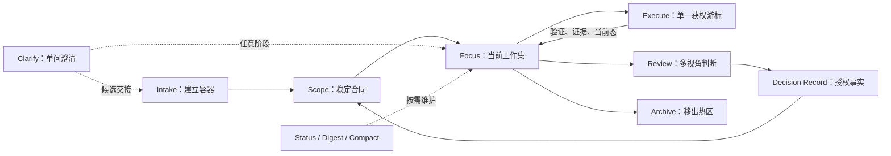

# Topic Lifecycle — 从混沌输入到长期恢复

> 本文解释 Prism topic 的生命周期。它不是模板，也不是 validator 规则；具体工件形态见 `workspace/templates/` 与 `skills/workflow/shared/topic-format-spec.md`。

---

## 一句话

topic 是一个长期推进的专项工作区。它的目标不是记录更多内容，而是让人和 Agent 在多轮协作后仍能恢复上下文、追溯决策、对齐当前工作集。

---

## 生命周期总览

Topic 有稳定工件关系，但没有必须完整执行的固定阶段。一个轻量问题可以在对话中自然结束；需要长期恢复和审计时才建立 Topic，再按当前认知熵源选择能力。



箭头表达允许的回流关系，不是默认执行顺序。Clarify 和 Status 可在任意阶段调用；Review 可发生在执行前、里程碑或方向变化时。

---

## 各阶段职责

| 阶段 | 主要工件 | 作用 | 生命周期 |
|------|----------|------|----------|
| 澄清 | 对话短确认；按需候选交接 | 先查事实，逐个澄清阻塞性人类取舍 | 默认零写盘 |
| 入料 | `references/intake.md` | 保留来源意图，避免以后忘记为什么建 topic | persistent |
| 合同 | `scope.md` | 定义目标、非目标、验收口径、约束、未决问题 | persistent |
| 聚焦 | `focus.md` | 声明当前只看什么，作为 topic 入口 | rewrite |
| 评审 | `reviews/rXX_*.md` | 暴露评审发现、风险、结论与建议 | append-only |
| 决策 | `decisions/dXX_*.md` / `decision.index.md` | Decision Record 原子固化明确授权，避免重复争论 | append-only / mutable index |
| 结构 | `structures/task-N_slug/` | 当某个 scope-V 深化到自带 scope + wave 时出现 | 按需 |
| 执行 | 当前 task wave、`verify/`、派生 focus | 推进一个已授权游标并闭合实现、验证与工件状态 | 单批次 |
| 归档 | `archive/` | topic 结束或废弃后移出热区 | terminal |

---

## 澄清与决策链

Clarify 只提供短确认或候选内容，不把推荐当作授权，也不正式写 Scope / Decision。无 Topic 时，需要治理的候选内容交 Intake；已有 Topic 时交回现有 workflow。

合同变化按授权强度分级：intake 初始收敛可在用户明确授权后直接进入 Scope；局部、低风险、可逆的 scope 修正可由显式授权进入 Scope。Review 驱动或达到长期审计门槛的合同变化必须经过：

```text
评审发现（finding）
  ↓
human Accept / Reject / Defer
  ↓
prism decision record
  ↓
decisions/dXX.md + decision.index.md + decision_artifact
  ↓
scope update
  ↓
focus refresh / task.index sync
```

这条链路治理的是决策熵：避免今天定过的事，几周后又重新争论。

---

## Focus 的位置

`focus.md` 是 topic 的当前工作集，也是当前 topic 入口。

它只回答：

```yaml
goal:     本轮聚焦什么
input:    本轮依赖哪些产物
output:   本轮预期产出
non-goal: 本轮明确不碰什么
```

focus 不沉淀历史，不保留版本。完成后整体 rewrite；历史进入 reviews / decisions。

---

## 什么时候升 task

默认不创建 task。

只有当某个 scope-V 深化到需要自己的 scope + wave 时，才升级：

```text
structures/task-N_slug/
├── scope.md
└── wave-N_slug.md
```

不要因为“复杂”就拆 task。先问：

- 这是不是一个被授权的问题切片？
- 它是否需要自己的收窄合同？
- 它是否需要独立推进批次？
- 新发现是否仍能冒泡回 topic 根的 review / decision？

如果答案是否，继续用 scope-V + focus。

已有唯一 task/wave 且方向已获权时，可用 `workflow-execute` 推进一个 structured 批次。无 structures 时，若当前 focus 是唯一 V-backed 有界批次且 fork-S3 不成立，也可走 topic-focus；验证后必须先写 verify 再 rewrite focus。它不会选择下一任务；多游标、结构异常或合同变化会停止并交回 Scope / Review / Decision 治理。Execute 不固定位于 Review 之后。

---

## 什么时候归档

归档不是压缩，也不是删除。归档只是把 topic 从热区移出。

**两种布局**（由 `archive_layout` / README 约定，`prism legacy archive` 自动选择）：

```text
# SDK 默认（flat）
topics/{NNN}_{topic}/  →  archive/{NNN}_{topic}/

# 项目扩展（monthly_topic，如 TVKMM）
topics/{NNN}_{topic}/  →  archive/YYYY-MM/topic/{NNN}_{topic}/
```

`project.yaml` 可选显式声明：

```yaml
archive_layout: monthly_topic   # 或 flat
index_style: narrative          # 或 anchored / manual
```

- **anchored**：`index.md` 含 `prism:topics` 锚点 + `## 历史归档` — archive 全自动
- **narrative**：`## 活跃专项` 富文本 + `## 归档` 分月表 — 脚本写归档表，活跃区手工
- **manual**：仅移目录，index 全手工

适合归档：

- 验收口径已完成；
- 方向已废弃；
- 后续工作已迁到新 topic；
- topic 不应再作为当前施工入口。

归档后保留历史原貌；如旧 frontmatter 容易误导，可加最小 `archived` 标识或顶部说明。

---

## Grandfather 规则

旧 topic 可能仍有：

- `README.md` 控制台
- `plan.md` 当前计划
- 根级 `intake.md`

这些不需要批量改。活跃推进时自然迁到 v3 形态；归档 topic 保持原样。

---

## 常见反模式

- 为一次性小修创建 task。
- 把 focus 当进度日志。
- 把 README 继续当新 topic 的当前工作集。
- 把 Clarify 候选内容直接当作正式合同或决策。
- review 后直接改 scope，而不经 Decision Record。
- 手写 dXX 和 index，绕过明确授权与可审计事件双门。
- task 内另开 reviews/decisions，导致决策链分叉。
- 为了省 token 改写 decision/review 原文。

---

## 与其他文档的关系

| 文档 | 关系 |
|------|------|
| [workspace-v3-upgrade.md](./workspace-v3-upgrade.md) | 已有 workspace 如何渐进采用 v3 topic 形态 |
| [skill-taxonomy.md](./skill-taxonomy.md) | 不同 skill 治理哪类认知熵 |
| [architecture.md](../architecture.md) | 完整架构与部署视图 |
| [glossary.md](../glossary.md) | 术语速查 |
