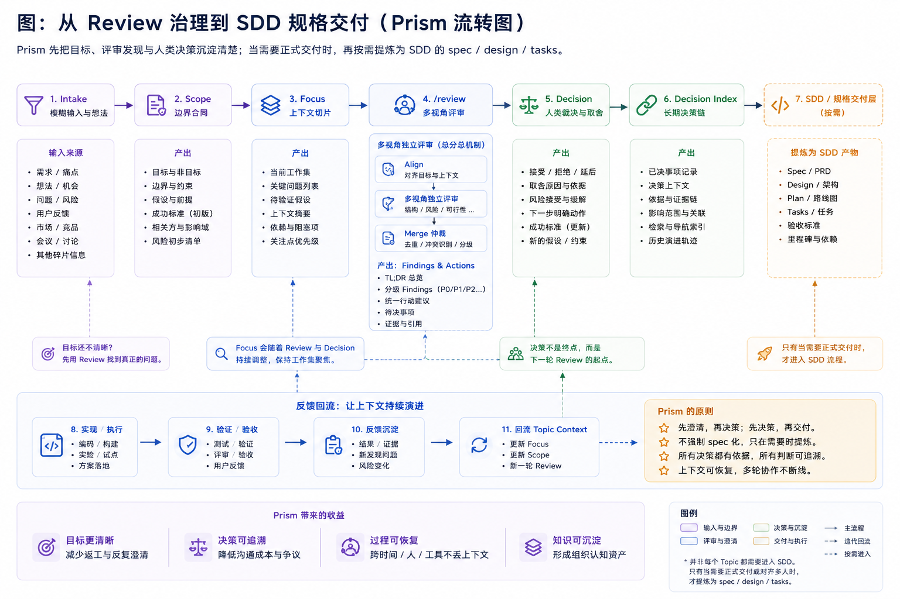

# Prism 安装后日常操作

> **定位**：`./setup.sh init` 完成后的命令面与习惯路径。verb 契约 → [cli-contract.md](./cli-contract.md)。
>
> **尚未 init** → [SETUP_GITHUB.md](../SETUP_GITHUB.md)（人类）· [SETUP_AGENT.md](../SETUP_AGENT.md)（Agent）

---

## 仓库根入口：`setup.sh`

人类在 SDK 仓库根目录的**首选入口**（`bin/setenv` 降为进阶路径）：

| 命令 | 委托 | 场景 |
|------|------|------|
| `./setup.sh` / `./setup.sh init` | `bin/setenv` + `bin/setup` | 首次配置 + relink + CLI 注入 |
| `./setup.sh check` | `bin/setup --check` | 健康检查（不修改） |
| `./setup.sh relink` | `bin/relink` | 刷新项目/Skills 软链 |
| `./setup.sh doctor` | `bin/doctor` | 深度体检（参数透传） |
| `./setup.sh update` | `prism update` | pull → doctor release → relink |

```bash
# 首次（示例）
cd ~/prism
PRISM_VAULT_PATH="$HOME/PrismWorkspace" PRISM_WS_SUBDIR="Prism/Workspace" ./setup.sh init
```

---

## 生命周期总览



```text
setup.sh init → prism --version 验收 → workspace-init / 桥接
             → 日常 workflow（可选）→ update / doctor / relink 维护
```

| 阶段 | 人类常用 | 说明 |
|------|----------|------|
| **验收** | `prism --version` · `./setup.sh check` | init 闭环 |
| **桥接** | `prism relink` · `./setup.sh relink` | vault + IDE 分发 |
| **topic** | `prism status` · `/workflow-intake` | 可选治理路径 |
| **升级** | `prism update` · `./setup.sh update` | pull + release doctor + relink |
| **诊断** | `prism doctor --scope config\|release\|ci` | 分 scope；`--json` 为 flat passthrough |
| **桥接修复** | `prism relink` | 软链漂移时 |

> **`prism doctor --json`** 不是 outer envelope。见 [cli-contract §4.3](./cli-contract.md)。

---

## 命令面分层（init 之后）

| 层 | 入口 | 何时用 |
|----|------|--------|
| **仓库根** | `./setup.sh` | 人类 init / check / update |
| **`bin/`** | `bin/setup` · `bin/doctor` · `bin/relink` | 底层脚本 / CI / 调试 |
| **`prism <verb>`** | `prism update` · `prism doctor` · `prism status` | **日常首选** |

**判断口诀**：

- 动 **本机环境 / 软链 / 全仓 skill** → `prism relink` 或 `./setup.sh relink`
- 动 **某个 topic 的 reviews / decisions / scope** → `prism validate` · `prism finalize` 等

---

## 运行时：`uv`（core contract）

Prism 脚本运行时 = **`uv`** + Python 3.11+（见 `pyproject.toml`）。

| 面 | 口径 |
|----|------|
| 入口 | `bin/prism` / `bin/doctor` / `bin/setup` → **`uv run python`** |
| 开发/CI | `uv python install 3.11` · `uv run --with pytest python -m pytest …` |
| 安装 | `bin/setup` 会尝试自动安装 uv；缺则报错并给安装指引 |

<details>
<summary>Degraded：无 uv 时</summary>

`bin/prism` 在找不到 `uv` 时会 **degraded fallback** 到系统 `python3` 并 stderr 提示。这是 bootstrap 容错，**不是**推荐路径。恢复：`bin/setup` 或 [uv 官方安装](https://docs.astral.sh/uv/getting-started/installation/)。

</details>

---

## 日常运维速查

### 环境与软链

```bash
cd ~/prism
./setup.sh check
bin/setenv --validate
prism relink
prism doctor --scope config --fix    # 非破坏性（如补全局 gitignore）
```

### topic / workflow

```bash
prism --version
prism status --project PRISM
prism sniff <dir> --kind review
prism validate <topic_dir>
prism finalize <topic_dir>
```

Agent slash：`/workflow-status` · `/workflow-intake` · `/workflow-scope` · `/workflow-review` · `/workflow-tidy`。

### 升级 SDK

```bash
./setup.sh update
# 等价分步：
cd ~/prism && git pull origin main
prism doctor --scope release --quick
prism relink
prism --version
```

> `prism update` 遇 dirty working tree 会 abort。不含 Vault pull（见下）。

---

## Vault 跨设备（可选）

Workspace Git **非** core contract 硬依赖。启用后见 vault `047` migration-guide（经 `workspace.*.local` 桥接）。

---

## E2E 验收 checklist

| # | 检查 | 命令 | 预期 |
|---|------|------|------|
| E1 | init | `PRISM_VAULT_PATH=~/PrismWorkspace ./setup.sh init` | 无 error |
| E2 | 配置 | `bin/setenv --validate` | 路径可达 |
| E3 | CLI | `prism --version` | 输出版本 |
| E4 | 软链 | `prism relink --check` | 错误: 0 |
| E5 | gitignore | `prism doctor --scope config --quick` | 无 blocking err |
| E6 | uv | `uv --version` | 可用（core contract） |

---

## 参考

- [cli-contract.md](./cli-contract.md) · [topic-lifecycle.md](./topic-lifecycle.md) · [skill-taxonomy.md](./skill-taxonomy.md)
- 认知叙事图示 → [prism-3.0.md](./prism-3.0.md) · [architecture.md](./architecture.md)
