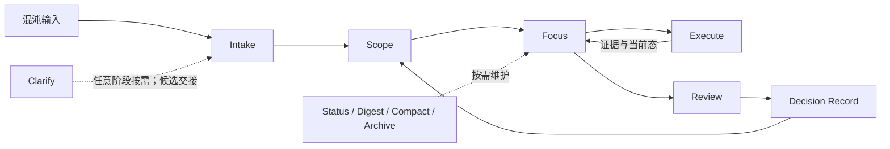

# Prism 3.2：按需治理闭环

> 本页描述 Prism 3.2 的按需治理闭环与能力边界。发行身份以仓库根 [README](../README.md)、`VERSION` 与 [CHANGELOG](../CHANGELOG.md) 为准；结构客观面见 [architecture.md](./architecture.md)。

## Prism 管什么

Prism 轻量治理长期人机协作中的认知熵：输入混沌、阻塞歧义、边界漂移、判断隐性化、决策重演、状态脱节、恢复成本和注意力滞留。

它不接管任务本身，也不是 Agent 调度器或重型 workflow engine。Protocol 提供协作契约，Workspace 保存可迁移状态，Skills 与 CLI 按需降低特定类型的熵。

## 不是固定管线

Workflow Skills 是可选能力，不是必须完整执行的阶段列表。一个轻量问题可以在对话中直接结束；一个长期专项可以从 Intake 建立容器，再按当下熵源调用 Scope、Execute、Review、Status 或 Archive。

图表达的是可回流关系，不是默认执行顺序。Clarify 可以发生在任意阶段，Review 也可以在执行前、里程碑或方向变化时触发。

## 五个职责边界

| 能力 | 负责 | 不负责 |
|------|------|--------|
| **Clarify** | 先调查事实，再用单问 micro-loop 澄清阻塞性人类取舍 | 不替用户决策；默认不写 Scope、Decision 或新 Topic |
| **Review** | 按风险组织多视角调查，合并评审发现、结论、风险和建议 | 不以硬阈值决定用户“配不配”做正式评审；不替用户接受结论，不把建议冒充为授权行动 |
| **Decision Record** | 在明确授权与可审计治理事件同时成立后，原子记录裁决、索引和痕迹 | 不做价值判断；不自动改 Scope；不选择下一步 |
| **Scope** | 维护目标、边界、验收与约束，并派生 Focus / task 结构 | 不从裸 review 或 Clarify 候选静默落权 |
| **Execute** | 推进一个现存且获权的 task / wave，完成实现、验证、证据与 Focus 对齐 | 不规划队列；不自动消费下一个游标；不改治理合同 |

Clarify 可以自然结束，也可以在用户明确要求后形成候选交接。无 Topic 时，治理需求先交 Intake；已有 Topic 时交回既有 workflow。

合同变化按授权强度分级：intake 初始收敛可在用户明确授权后直接进入 Scope；局部、低风险、可逆的 scope 修正可由显式授权进入 Scope；review 驱动或达到长期审计门槛的合同变化走 Decision → Scope。

## 评审与兼容

正式 Review 由用户意图触发。需要多视角时就执行多视角调查，角色数量按风险和信息面调整；报告先完整展示评审发现、结论、建议、风险和未决问题，再进入 Accept / Reject / Defer Gate。

Review 是一次有边界的判断事件，不是长期治理状态。Finding 只是基于证据形成的局部观察或问题判断；未被采纳时保留在 rXX 历史现场即可。只有用户 Accept / Reject / Defer 后进入 Decision chain，或用户另行显式授权后，建议才能转化为 scope 变更、action、执行目标或后续正式治理事件。

`workflow-review-lite` 自 3.2 起是 retired-with-compat：不出现在 active/default/recommended 路径，只保留显式 legacy 调用、旧 Topic 和旧 `type: review-lite` 产物兼容。日常轻量判断使用模型原生自检，阻塞歧义使用 Clarify，需要持久多视角判断使用 Review。

## 与 FrostAtlas 的分工

Prism 治理为什么做、做什么、边界、注意力和决策；[FrostAtlas](https://github.com/ArnoFrost/FrostAtlas) 治理长程执行、验证、证据和关口。

两者可以通过 Scope 合同与执行证据形成回流，但不会互相扩权：Prism 不因接收证据而接管执行循环，FrostAtlas 也不替人类改写治理边界。

## 3.2 实验边界

- Clarify、Decision Record 与 Execute 随 3.2 提供，但仍是需要持续 dogfood 的实验能力。
- 版本发行不等于能力转正；实验接口仍可在后续 minor 调整名称、参数或交互。
- Review Lite 的兼容面继续保留，迁移说明见 [review-lite-compatibility.md](./review-lite-compatibility.md)。
- 当前能力选择见 [skill-taxonomy.md](./skill-taxonomy.md)，Topic 阅读路径见 [topic-lifecycle.md](./topic-lifecycle.md)。
- 3.0 的历史成立锚点保留在 [prism-3.0.md](./prism-3.0.md)，不改写成 3.2 叙事。
