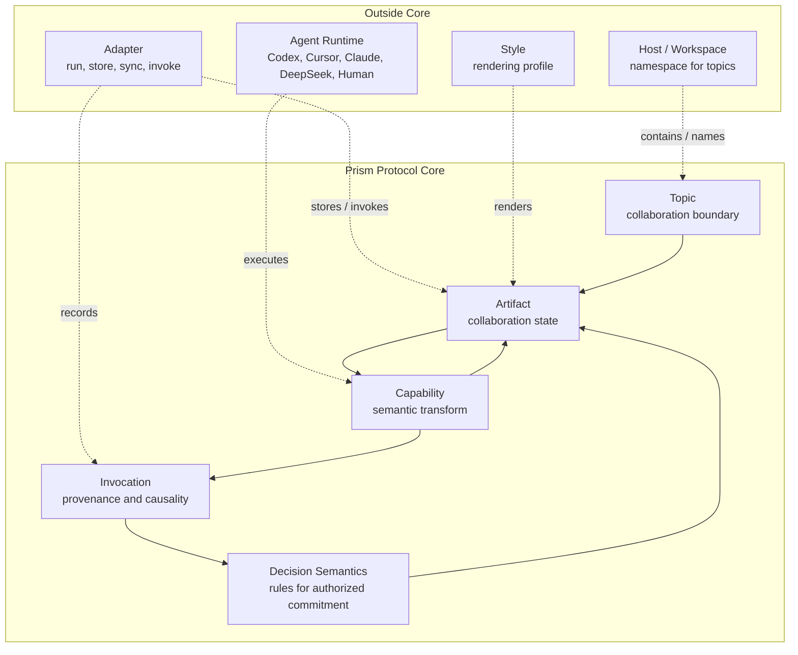
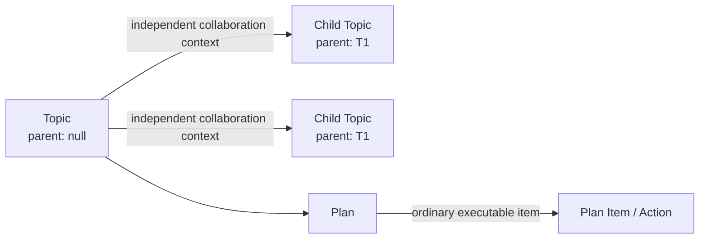
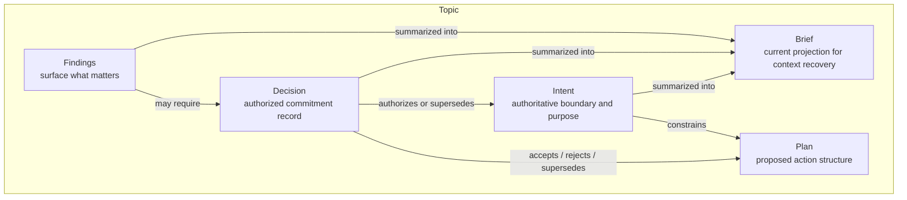
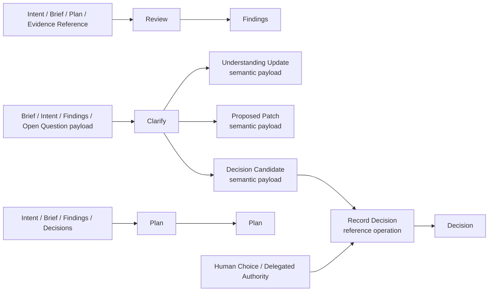
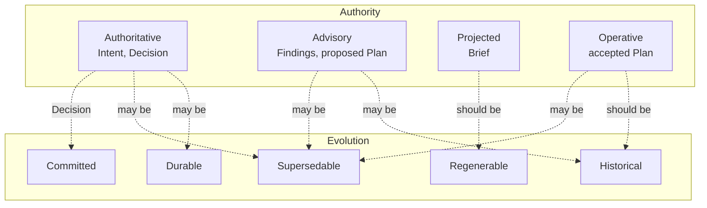
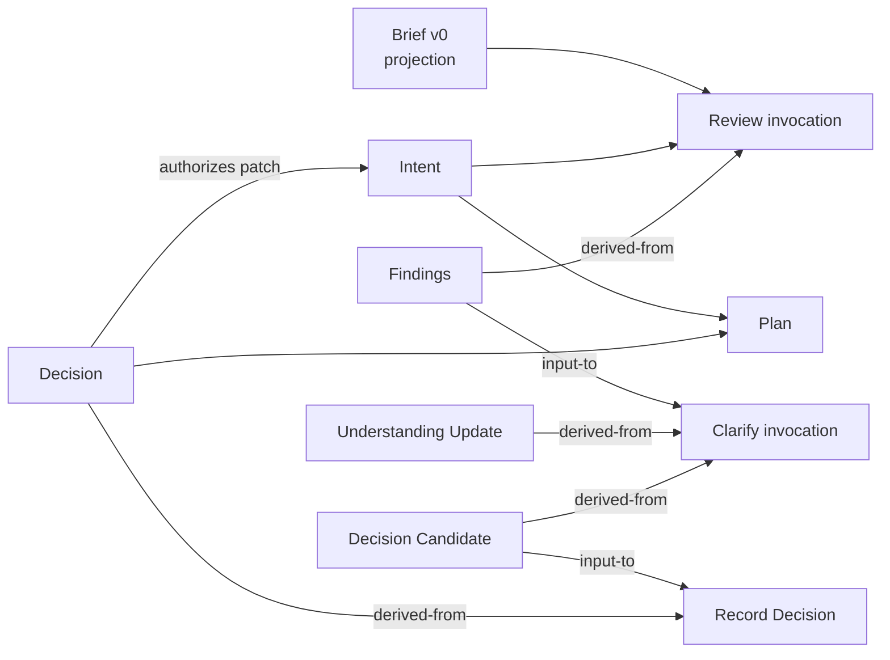

# Prism 4.0 Architecture Guide

> 架构图设计指导草案。本文只表达 Prism 4.0 的语义边界与图示口径，不定义实现计划，不引入 Runtime / Graph Engine / UI。
> 语义源是 `prism-4-refoundation-alignment.md`；本文只镜像和图示它，不重定义 Core。

## 1. 图示目标

4.0 的架构图不应再画成固定 workflow。它应表达：

- Topic 定义协作边界。
- Artifact 承载协作状态。
- Capability 读取、产生或提出工件变化。
- Invocation 保留调用、来源与因果关系。
- Decision 固化被授权的关键承诺。
- Host / Adapter / Style / Runtime 都在 Core 外围。
- Graph 是 Invocation 和 Relation 形成的观察视图，不是执行引擎。

一句话：

```text
Core is protocol semantics, not an implementation stack.
```

## 2. Core Boundary



Design notes:

- `Workspace` is shown as Host, not as a Core primitive.
- `Adapter` and `Style` are outside the protocol, even if the reference implementation ships them.
- Runtime executes providers, but it does not define Capability identity.
- Provider / Runtime / Session / Approval / Event / Dependency stay outside Core.
- `Invocation` is not a workflow engine. It is the causal trace of actual calls.
- `Decision Semantics` is a rule set governing the Decision artifact role, not another artifact or runtime object.

### 2.1 Style Profile Slot

Style Profile 是 Reference Experience 的可选槽位，用来描述同一份 Prism Artifact 在不同人、项目或工具中的阅读呈现。默认 profile 为空：SDK 写出的 canonical artifact 应保持可移植 Markdown，不要求 Obsidian、OFM、wiki link、特定 CSS 或任何个人 vault 规则。

个人或项目可以在外部 skill、项目约定或 adapter 配置中声明 Style Profile，例如 Obsidian/OFM callout、高亮、表格密度、状态标记与标题层级。这些偏好只改变阅读性，不改变以下语义：

- Artifact role、id、frontmatter 与 relation。
- Intent / Decision / Findings / Plan / Brief 的权威性和演进语义。
- `record ≠ 授权`、Brief 不是事实源、Findings 不自动形成 Decision 等 Core 规则。

当 Agent 未明确加载某个 Style Profile 时，应按 SDK 默认阅读面写作。加载后，也只能做可逆的呈现增强：可以增加 callout 或高亮帮助扫描，但不能把样式块当作新的事实源、行动授权或持久工件类型。

## 3. Topic Model



Rule:

```text
Independent collaboration context -> Child Topic.
Need to be done -> Plan Item / Action.
```

This removes `Task` from Core. A former Task is either a Child Topic or a Plan Item.

Session rule:

```text
Topic = collaboration continuity.
Runtime session = interaction continuity.
Session != Topic.
```

## 4. Artifact Roles



Authority rule:

```text
Decision / Intent / source artifacts outrank Brief.
Brief is never the source of truth.
```

Artifact roles stay limited to:

```text
Intent
Brief
Findings
Decision
Plan
```

Other typed content in diagrams is semantic payload, not a new Artifact Role.

## 5. Capability I/O



Capability rule:

```text
Capability declares typed inputs, typed outputs, and effect policy.
It does not declare a fixed place in a workflow.
Capability identity is independent of provider/runtime realization.
```

Provider realizes a Capability outside Core. Invocation records one actual semantic use of that Capability, with causal provenance and optional execution metadata.

Typed inputs and outputs may be persistent Artifact Roles or transient semantic payloads. Do not promote `Understanding Update`, `Proposed Patch`, `Decision Candidate`, `Open Question`, or `Evidence Reference` into Core Artifact Roles unless dogfood proves they need independent identity, lifecycle, authority, and cross-invocation references.

MVP Core capabilities:

- `Review`
- `Clarify`
- `Plan`

Reference operation:

- `Record Decision`

`Record Decision` is kept out of MVP Core Capability until real use proves that decision recording itself needs a reusable semantic transformation process.

## 6. Authority and Evolution



Do not use storage words such as:

```text
append-only
rewrite
file history
folder layout
```

Use protocol words instead:

```text
authoritative
advisory
projected
operative
durable
supersedable
regenerable
historical
committed
```

Authority and Evolution are normative protocol semantics first. A reference adapter may serialize them as metadata, relations, derived state, or another representation. Do not imply that MVP must implement these as fixed enum fields.

Authority guard:

```text
Production does not imply acceptance or commitment.
Availability, invocability, and authority are distinct concerns.
```

These are semantic checks, not a requirement to add fixed schema fields such as `available`, `invocable_by`, or `authorized_by`.

## 7. Invocation Graph

Definitions:

```text
Invocation = record of an actual capability use and causal provenance.
Relation = semantic relation among artifacts, decisions, and/or invocations.
Graph = emergent view formed by invocation records and relations.
```

Adapter fidelity:

```text
In-memory / JSON reference store -> can expose a full Invocation graph.
Local Markdown files -> persist artifact-level relations and provenance projection.
Brief / index files -> projections, never graph facts.
```

The local file adapter intentionally acts as a weak-provenance adapter. It does
not persist raw Invocation records by default, and it does not promise a full
Invocation graph. That does not remove Invocation from the protocol; it means
this adapter exposes a weaker graph view through artifact frontmatter,
artifact-level relations, indexes, and CLI record ids. Deep audit scenarios
should use explicit Findings / Decision body evidence or an optional audit
profile, not default write-only trace logs.

Runtime boundary:

```text
Runtime Event != Invocation.
Execution Graph != Invocation Graph.
Runtime Dependency Graph != Invocation Graph.
```

Invocation is semantic capability use and causal provenance. Tool calls, retries, cache hits, approval prompts, session forks, and plugin dependency edges belong to Runtime / Adapter concerns unless they are summarized into collaboration-semantic artifacts or relations.

Invocation conceptually identifies:

```text
invocation identity
capability used
referenced inputs
produced outputs
optional execution metadata
```



This graph is an observed trace. It is not a required path.

It is also not a Graph Engine, scheduler, query DSL, or required runtime.

Valid shorter paths include:

```text
Existing Artifact -> Plan
Review -> Findings
Clarify -> Proposed Patch
Intent + Brief -> Plan
```

Keep relation vocabulary small:

```text
derived-from
supports
supersedes
authorizes
projects
references
```

This is a minimal starter set, not a closed enum. Add relations only when dogfood shows that a stable semantic relation cannot be represented clearly with the starter set.

Canonical relation direction is `source --relation--> target`; for example, `finding:f01 --derived-from--> invocation:...` and `decision:d01 --authorizes--> plan:p01`. Diagrams may still draw input/output flow for readability, but relation arrows should be labeled when direction matters.

## 8. Diagram Style Guidance

When drawing Prism 4.0 diagrams:

- Put `Prism Protocol Core` in the center.
- Put Host / Adapter / Style / Runtime outside Core.
- Use nouns for artifacts and verbs for capabilities.
- Show `Brief` as a projection, not as a database or fact source.
- Show `Decision` as authority, not as ordinary generated text.
- Show `Child Topic` through `parent` relation, not a separate Task box.
- Draw arrows as actual relations: input, output, supports, supersedes, authorizes, projects, invokes.
- Avoid pipeline diagrams unless explicitly showing one example trace.

## 9. Design Review Checklist

Before adding a concept to 4.0 Core, ask:

- Does this describe a stable collaboration invariant?
- If the implementation disappears, does the concept still hold?
- Can this be represented as an Artifact role, Capability policy, Invocation relation, or Adapter behavior instead?
- Does this concept still work for software, research, writing, and simple tasks?
- Does this concept reduce ambiguity without creating a new DSL?
- Is this semantic identity, or provider/runtime identity?
- Is this collaboration authority, or runtime approval?
- Is this semantic provenance, or runtime telemetry?
- Is this projection reconstructable from durable state?

Default answer:

```text
If it can live outside Core, keep it outside Core.
```

## 10. Current Open Questions

1. Should `Workspace` remain Host / namespace, or become a Core primitive later?
2. Should `Record Decision` stay a Reference Operation, or become a special Core Capability after dogfood?
3. Should `Action / Plan Item` remain internal to Plan, or become a named artifact role later?
4. Is `Intent` the best common term for boundary and purpose across non-engineering domains?
5. Does `Review` feel too engineering-heavy for writing and research, or is its definition broad enough?

## 11. One Screen Version

```text
Prism Protocol

Topic
  defines the collaboration boundary

Artifact
  carries collaboration state by role
  roles: Intent, Brief, Findings, Plan, Decision

Capability
  transforms or proposes artifacts
  core: Review, Clarify, Plan
  identity survives provider/runtime replacement

Invocation
  records semantic provenance, not runtime telemetry

Decision Semantics
  governs authority and commitment, not runtime approval

Outside Core
  Host / Workspace
  Adapter
  Style
  Agent Runtime
```
