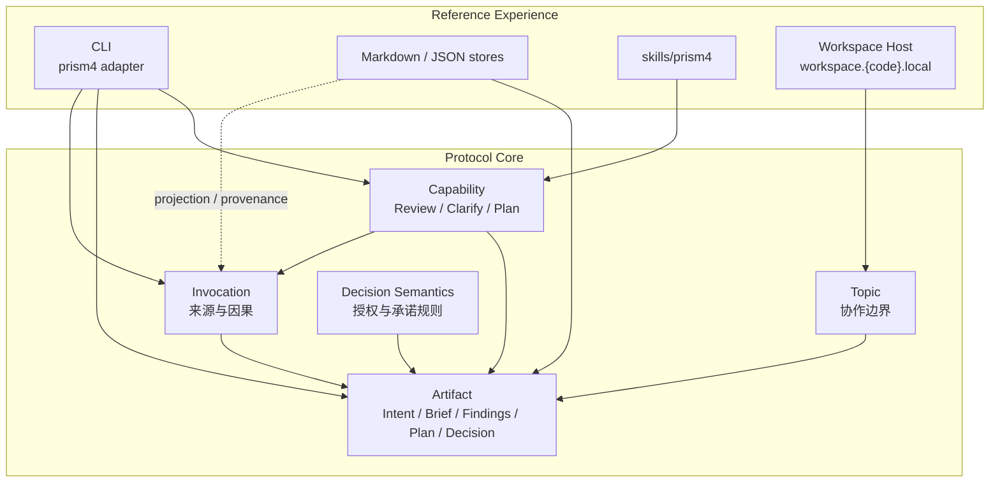

# Prism 4.0 Open Source Readiness Review

> 本文是 4.0-canary 面向开源、历史包袱清理、能力/工件 graph 组织的维护者评审。它不定义 Protocol Core；语义源仍是 [prism-4-refoundation-alignment.md](./prism-4-refoundation-alignment.md) 与 [architecture.md](./architecture.md)。

## 结论

Prism 4.0 现在可以进入主力机 canary 和小范围开源预览。当前没有发现阻断 canary 的硬伤；主要剩余工作是正式发布策略、CHANGELOG 历史脱敏策略和后续真实项目样本沉淀。

综合评分：**7.9 / 10**。

| 维度 | 当前评分 | 判断 |
|------|:------:|------|
| 开源首试入口 | 7.5 | README / SETUP / migration 已去私有化，仍需正式 release policy |
| 历史包袱清理 | 8.0 | 3.x 实现与默认 skill 面已剔除，historical 归档仍需明确只读语气 |
| Protocol / graph 语义 | 8.2 | Core 边界清晰，Invocation Graph 已说明 adapter fidelity |
| 文档与实现一致性 | 8.0 | 关键 guard 已补，仍需随 canary 持续守门 |
| 泛化验证准备度 | 7.8 | 已适合真实项目 canary，样本数还不足以宣布稳定 |

## 证据

本轮评审基于当前工作树与以下验证结果：

```bash
bin/validate-skills --layer sdk --json
bin/validate-skills --json
bin/doctor --quick
uv run pytest
uv run python bin/release_gate.py
```

最近一次完整结果：`uv run pytest` 通过 156 项；`release_gate.py` 通过；skills validation 为 0 error / 0 warning；`doctor --quick` 为 0 error / 0 warning。

## 4.0 组织图

这张图用于维护者判断“应该把新概念放哪里”。它不是固定流程，不代表 Review 必须接 Clarify，也不代表 Topic 内一定要出现所有 Artifact。



判断规则：

- 新的协作状态优先表达为现有 Artifact role。
- 新的方法优先表达为 Capability，不要把它写成固定 workflow。
- 新的历史或来源关系优先表达为 Invocation / Relation。
- Workspace、Skill、Env、CLI、Markdown 文件都在 Reference Experience，不要提升成 Core。

## 已修复的高 ROI 项

| 项 | 处理结果 | 防回归证据 |
|----|----------|------------|
| 公开入口默认 SSH clone | README / SETUP 改为 HTTPS | `test_open_source_surface_has_no_private_or_retired_entrypoints` |
| 迁移手册含个人项目与本机路径 | `docs/migration.md` 改为 `~/your-project` / `<CODE>` 通用 runbook | 同上 |
| 活文档描述已删除的 3.x 目录 | `docs/architecture.md` 当前树同步到 prism4 实现 | docs surface tests |
| schema/template 仍教 workflow skill | 示例统一为 `prism4` / `prism-review` / `prism-topic` | `test_current_skill_schema_examples_use_prism4_surface` |
| dist profile 仍保留 mini/full legacy 面 | 当前 whitelist 只保留 prism4 profile | skills validation |
| Plan 文档写 operative、实现写 advisory | artifact-format 与 `record_plan()` 统一为 advisory / regenerable | `test_plan_format_matches_reference_record_plan_semantics` |
| Invocation Graph 口径强于 local adapter | architecture guide 增加 adapter fidelity 说明 | docs + core/local adapter tests |
| 旧 CLI 文档断链/误导 | 当前入口指向 `bin/README.md`，3.x 契约归 historical | docs surface tests |

## 剩余风险

### R1 中 — 正式发布策略尚未裁决

当前可以做 GitHub source canary，但还没有决定是否发布 PyPI 包、是否暴露 `console_scripts`、版本 tag 如何命名、release artifact 是否包含 skills zip。这个不阻断本机验证，但阻断“公开稳定首发”。

候选动作：先将 4.0 首发限定为 GitHub source release + `setup.sh init`，PyPI 留到真实外部用户反馈后再定。

### R2 中 — historical 搜索命中仍可能误导新人

`docs/historical/` 中保留大量 3.x 术语是合理的；风险在于搜索命中后被当成当前命令。当前已经在 docs index 与 legacy contract 顶部加了历史提示，但正式公开前可以再做一次 historical banner 扫描。

候选动作：只给 historical 文档加顶部读法，不改写历史正文。

### R3 中 — CHANGELOG 仍是内部演进账本

CHANGELOG 可能包含 workspace.local、内部编号或 dogfood 语境。作为历史日志可保留，但公开首发前最好明确哪些条目是 canary 内部记录，哪些是用户可读 release note。

候选动作：保留完整 CHANGELOG，另起 `RELEASE_NOTES.md` 或 GitHub release note，面向公开用户写短版。

### R4 低 — 泛化样本仍不足

当前测试覆盖 reference adapter 与文档 guard，但真实项目 canary 样本还少。主力机切换后，应至少选 2-3 个不同类型项目验证：代码项目、文档/知识项目、个人工具项目。

候选动作：每个项目只新建 4.0 Topic，不迁移旧 topic；记录 probe 输出、第一轮 Review/Brief 是否自然。

## 迁移前硬伤清单

现在未发现必须阻断切换的硬伤。切换前只需要确认：

| 检查 | 通过标准 |
|------|----------|
| SDK 分支 | `git status --short --branch` 位于 4.0 分支或发布 tag |
| 环境 | `bin/doctor --quick` 无 error / warning |
| 分发 | `bin/relink --dry-run` 只出现预期映射 |
| 测试 | `uv run pytest` 全量通过 |
| 项目桥接 | `prism topic probe` 显示 `bridged: yes` |
| 旧 topic | 只读保留；若 probe 显示 `legacy_dirs`，不得直接改写 |
| 新协作 | 用 `prism topic new` 建 4.0 Topic 承载 canary |

## 下一轮高 ROI

| 优先级 | 项目 | 产出 |
|--------|------|------|
| P0 | 裁决 4.0 首发交付面 | Decision：GitHub source only / PyPI / zip profile |
| P1 | 写公开 release note | 一页用户可读变化说明，避开内部路线编号 |
| P1 | historical banner 扫描 | 确保所有 3.x 高命中文档顶部都说清当前分支只读 |
| P1 | 主力机 2-3 项目 canary | 每个项目一个 4.0 Topic + 简短 Findings |
| P2 | README 加 canary badge 后的稳定发布口径 | 从 4.0-canary 过渡到正式版本时再做 |

## Future Agent 指令

给未来 Agent 执行迁移验证时，可以直接引用：

```text
请先读 docs/migration.md 和 docs/prism-4-open-source-readiness-review.md。
按 migration.md 的「主力机切换 runbook」执行环境切换与健康检查。
按 readiness review 的「迁移前硬伤清单」逐项核验。
在目标项目里只创建新的 4.0 Topic；旧 3.x topic 只读，不迁移、不改写。
最后输出 probe 结果、测试结果、canary Topic 路径，以及是否命中 R1-R4 中的剩余风险。
```
