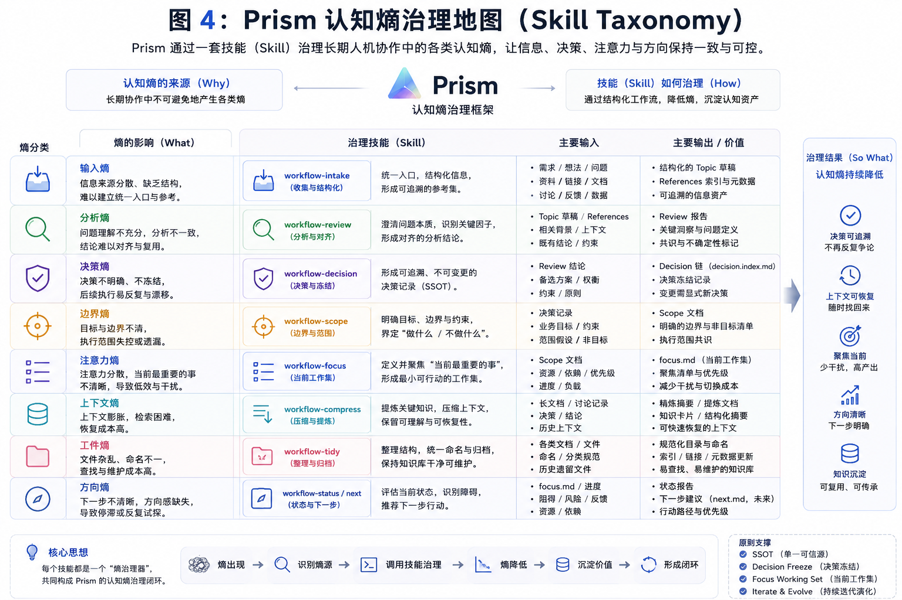
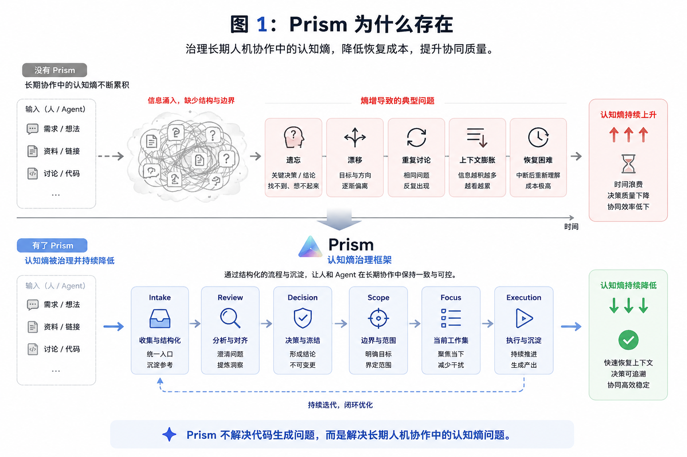

# Skill Taxonomy — 按认知熵源理解 Workflow Skills

> 本文是人类阅读用的 skill 全景图，不是 skill registry，也不是协议级术语表。
> 机器可见的技能清单仍以 `skills/schema/skills-catalog.yaml` 为准；受控术语仍以 `skills/workflow/shared/vocabulary.md` 为准。

---

## 为什么需要这张图

Prism 是轻量认知熵管理框架；workflow skills 是它内置的一套认知熵治理工作流，而不只是“工具列表”。在 v3.0 中，这些 skills 分别治理长期人机协作中的不同认知熵源：

- 输入混沌
- 边界漂移
- 判断隐性化
- 决策重演
- 当前工作集膨胀
- 执行态与工件态脱节
- 工件状态漂移
- 对外沟通成本
- 上下文恢复成本

这张图帮助你判断：**现在的问题是哪类熵，该调用 workflow 中的哪个 skill。**

---

## Workflow Skills 全景

| Skill | 治理的熵源 | 读取 | 输出 | 默认行为 | 3.0 成熟度 |
|---|---|---|---|---|---|
| `workspace-init` | 接入熵 | 项目路径、Prism 配置 | workspace 骨架、桥接、注册 | 按需 | public / stable |
| `workflow-intake` | 输入熵 | 原始需求、散落上下文 | `references/intake.md`、初始 scope/focus | 按需 | public / stable |
| `workflow-scope` | 边界熵 / 注意力熵 | decision / review / scope | 更新 `scope.md`，刷新 `focus.md`，同步 task.index | 按需 | public / stable |
| `workflow-execute` | 执行漂移 / 工件脱节 | 唯一 structured task/wave 或合格 topic-focus + 项目代码 | 实现、验证、证据、派生 focus 与机械校验 | 按需 | dev / experimental |
| `workflow-review` | 分析熵 | 方案、diff、topic 状态 | 多角色 findings、actions、rXX | 按需 | public / stable |
| `workflow-review-lite` | 轻量分析熵 | 旧 topic / 显式兼容调用 | 单视角 findings、actions | soft-deprecated | public / stable |
| `workflow-tidy` | 工件熵 | topic 工件、索引、frontmatter | 机械对齐后的索引/元数据 | 辅助 | public / stable |
| `workflow-status` | 方向熵 / 健康熵 | workspace / topic | report-first 健康报告 + `next_actions[]` handoff | 辅助 | public / stable |
| `workflow-digest` | 沟通熵 | topic 工件 | 面向协作者的状态快照 | 辅助 | public / stable |
| `workflow-compact` | 上下文熵 | 膨胀 topic | 默认 `compact_plan` preview；授权后 backup→apply | 低频 | dev / experimental |
| `workflow-archive` | 注意力熵 | 已结束 / 尘封 topic | preview→移入 `archive/`；`prism reactivate` 可拉回 | 低频 | dev / experimental |

---

## 读法

### 不确定新需求归哪

优先 `workflow-intake`。它治理输入熵，把混沌意图转成 topic / scope / focus 可承载的形态。

### 已经有决策，边界需要更新

用 `workflow-scope`。scope 是 focus 和 structures/task.index 的唯一上游。

### 方向变了，或需要多视角判断

用 `workflow-review`。review 的价值是把隐性判断变成可追溯 findings。

### 已有明确游标，需要继续执行

用 `workflow-execute`。它只推进一个显式或唯一的 structured task/wave；无 structures 时，也可在当前 focus 是唯一 V-backed 有界批次且 fork-S3 不成立时走 topic-focus。多游标、结构异常、合同变化或新方向会停止并交回治理流程。

### 日常小改或快速校准

3.1 Lite 起默认用模型原生自检或自然语言澄清，不再把小改动自动导向 `workflow-review-lite`。需要持久化、多视角或可审计判断时，显式使用 `workflow-review`；旧 topic 仍可显式调用 `workflow-review-lite` 读取和校验历史产物。

### 工件状态乱了

用 `workflow-tidy`。它只做机械对齐，不改 scope 目标，不替你决策。

### 不知道下一步

先用 `workflow-status` 做 report-first 巡检。报告中的 `next_actions[]` 只 handoff 到目标 skill，不自动执行写盘。

### topic 太胖，接手读不动

用 `workflow-compact` 做 preview。默认只输出 `compact_plan`；用户显式授权且通过 backup Gate 后才 apply。不改 scope/focus 合同语义。

### topic 已结束，想释放注意力

用 `workflow-archive` 或 `prism archive` preview。需要继续跟踪时用 `prism reactivate` 拉回 `topics/`。

---

## 边界

- Skill taxonomy 不是 vocabulary，不新增受控术语。
- `workflow-execute` 随 Prism 3.0 提供，但保持 dev / experimental；它不消费 `next_actions[]`、不选择 Next、不循环调度。
- `compact` / `archive` 为 dev experimental，不列入 3.0 GA formal 能力面；`next_actions[]` 是 status 的 handoff 建议，不是自动编排器。
- 跨对话 `handoff` 文档形态仍非默认流程。
- 不需要 workflow skills 时，可以纯手写 workspace 状态；Prism core contract 不强制 review/decision/scope 全套。
- 不把 Prism 缩窄成 workflow：workflow 是内置治理工作流，Prism 还包含协议、CLI、技能分发和 workspace 状态容器。

---

## 与其他文档的关系

| 文档 | 关系 |
|------|------|
| [prism-3.0.md](./prism-3.0.md) | 解释为什么用认知熵治理理解 Prism |
| [topic-lifecycle.md](./topic-lifecycle.md) | 解释 topic 在生命周期中如何流转 |
| [workspace-v3-upgrade.md](./workspace-v3-upgrade.md) | 解释已有 workspace 如何渐进接入 v3 |
| [architecture.md](./architecture.md) | 完整架构与部署视图 |
| [glossary.md](./glossary.md) | 人类术语速查 |
