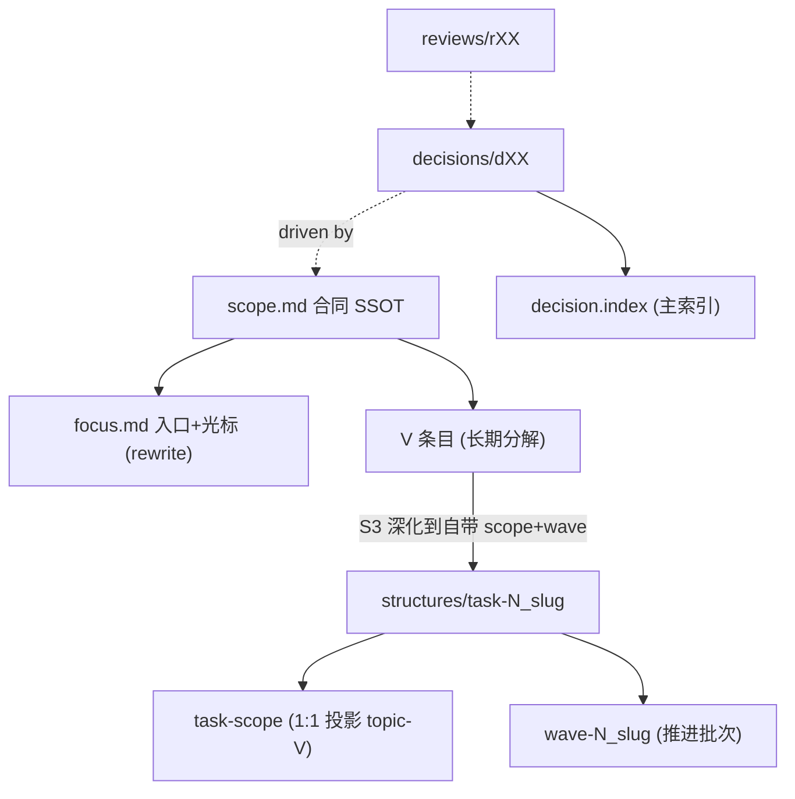

# Topic 格式规范 SSOT

> topic **整体形态**的对标基准。定义 topic 解剖 / 入口模型 / 递归结构 / 各工件形态契约。
> **cite 不复制**：术语·kind·retention → [vocabulary.md](./vocabulary.md)；scope→focus 刷新·双区·README-deprecate·分叉判据 → [focus-derive-spec.md](./focus-derive-spec.md)；scope 段落规范 → `scope-templates.md`；focus 可读性 → [focus-readability-checklist.md](./focus-readability-checklist.md)；痕迹 → [trace-artifacts-spec.md](./trace-artifacts-spec.md)。
> 本 SSOT 只定义"topic 长什么样"，细节一律 cite 详规，避免漂移。

## 1 Topic 解剖（工件清单）

| 工件 | type | kind | retention | 角色 | 落点 |
|------|------|------|-----------|------|------|
| `scope.md` | scope | governance | persistent | 合同 SSOT（focus/task 唯一上游）| topic 根 |
| `focus.md` | focus | state | **rewrite** | **唯一入口 + 注意力光标**（双区）| topic 根 |
| `decision.index.md` | decision-index | state | mutable | 决策链**主索引** SSOT（事件链）| topic 根 |
| `review.index.md` | review-index | state | mutable | 评审**辅助索引**（稀疏关联律）| topic 根 |
| `decisions/dXX.md` | decision | governance | persistent | 决策事件（append-only）| decisions/ |
| `reviews/rXX.md` | review | governance | persistent | 评审事件（append-only）| reviews/ |
| `references/intake.md` | intake | state | persistent | 来源意图留档 | references/ |
| `structures/task-N_slug/` | task | structure | — | 递归分解（**按需**膨胀）；稳定 id 仍为 `tN` | structures/ |
| ~~`README.md`~~ | topic-readme | state | mutable | **deprecated → focus 入口**（存量兜底）| topic 根 |

> kind 五元 / retention 律的定义见 [vocabulary.md](./vocabulary.md)，本表只列归属不复制语义。

## 2 入口模型（README deprecate → focus 双区）

- topic **唯一入口 = focus 保留区**（AI 规范入口 + scope/decision.index/review.index 双链）。
- README **deprecate**：存量兜底、懒迁移（grandfather，同 plan→focus）；关键决策 SSOT = `decision.index`，参考资料 = `references/` + focus 保留区双链。
- 详见 [focus-derive-spec.md](./focus-derive-spec.md) §README-deprecate + §双区契约。

## 3 递归结构（scope 的自相似）

- **单层**（默认）：`scope`（合同）→ `focus`（每轮注意力，rewrite）；长期分解压在 scope 的 **V 条目**。
- **递归**（按需）：某 scope-V **深化到自带 scope+wave（S3）** → 膨胀 `structures/task-N_slug`——`task-scope` **1:1 投影** topic-V（双层守恒，不创造新承诺）+ `wave-N_slug.md` 推进批次。
- **数字稳定，slug 可读**：稳定 id 只由数字 N 派生（`task-4_xxx` → `t4`）；slug 只给人读，改 slug 不应改变引用身份。
- **单一决策链**：task 内**不开** `reviews/` `decisions/`；治理需求冒泡回 topic 根。
- 分叉判据（**S3 主触发**，provisional）见 [focus-derive-spec.md](./focus-derive-spec.md) §分叉判据决策表。

## 4 各工件 canonical form & 可读性

| 工件 | canonical form | 可读性度量 |
|------|----------------|-----------|
| `focus` | 双区（保留区 rewrite 豁免 / 聚焦区 rewrite）+ 光标块固定 2 行 + 4 字段白名单 + 禁 callout 包裹（[topic-focus.md](../../../workspace/templates/topic-focus.md) 模板）| M1-M4 见 [focus-readability-checklist.md](./focus-readability-checklist.md) |
| `scope` | 6 段（目标/非目标/验收口径/关键约束/未决问题/变更记录）+ 段落白名单 + 形态约束（详规 `scope-templates.md`）| 行数 ≤60 / 段落合规 / 单行密度 / V·OQ 可溯源（详规 `scope-templates.md`）|
| `task.index` | task 导航表：task 路径 / 稳定 id / 可选 label / status / 问题切片 / 授权来源；只在出现 task 时存在 | task id 稳定、授权来源可追溯；slug/label 只做展示，不替代 `tN` |
| `task-scope` | task 内 `scope.md`，1:1 投影 topic 级 V；只收窄不新增承诺；task 内不开独立 reviews/decisions | task-V 每行引用一个存在的 topic-V |
| `wave` | task 内推进批次；文件名可含 slug，标题写清本批目标，并记录推进记录 / 批次出口；无 task 时不落独立 wave 文件 | status 与 task.index 一致；编号 M 表示顺序，slug 只做展示 |
| `decision` / `review` | append-only 事件，frontmatter 依赖字段（`supersedes`/`derived_from`/`related_dXX`）| — |
| `*.index` | mutable 导航面，原地更新 | — |

## 5 对标关系（详规 SSOT 索引）

| 维度 | 详规 SSOT |
|------|-----------|
| 术语 / kind 五元 / retention 律 | [vocabulary.md](./vocabulary.md) |
| scope→focus 刷新 / 双区 / README-deprecate / 分叉判据 | [focus-derive-spec.md](./focus-derive-spec.md) |
| scope 段落规范 / 复杂度边界 / canonical form | `scope-templates.md`（scope/references/）|
| focus 可读性度量（M1-M4）| [focus-readability-checklist.md](./focus-readability-checklist.md) |
| 痕迹工件（intake_gate_out / task_probe / merge_artifact / decision_artifact）| [trace-artifacts-spec.md](./trace-artifacts-spec.md) |
| 上下文装配 | [context-pack-spec.md](./context-pack-spec.md) |

> 各 workflow skill 的能力须对标本 SSOT：入口语义归 focus 保留区，产出/消费遵循上表形态契约。
